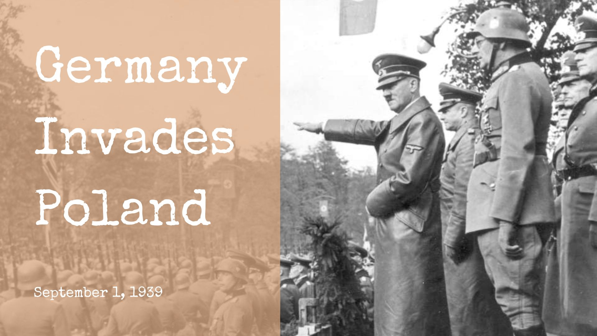
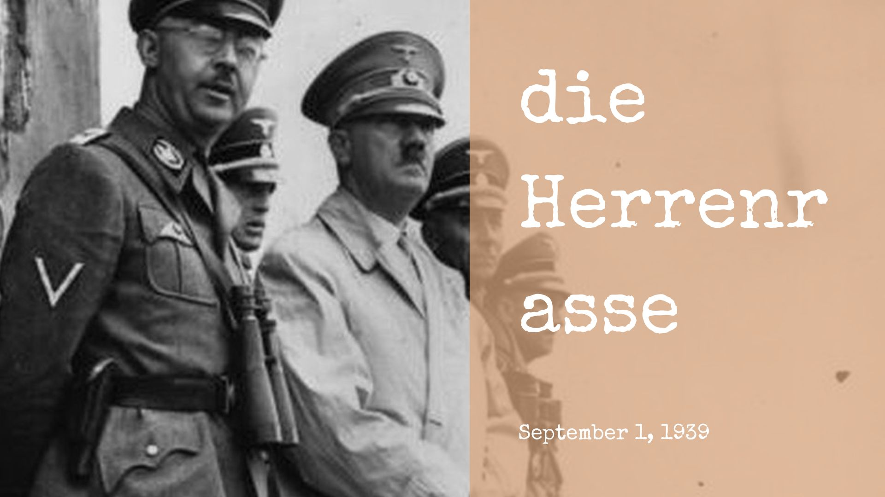

_Disclaimer : Tulisan ini disusun berdasarkan fakta-fakta yang tersebar di berbagai sumber di internet dan telah melalui pengecekan berulang kali untuk memastikan keakuratan informasi yang disajikan. Namun, jika terdapat kesalahan atau ketidaksesuaian, pembaca diharapkan untuk melakukan verifikasi lebih lanjut dari sumber terpercaya, big thanks to GraiHan._
  

    <video id="thumbnailVideo" style="width: 100%; max-width: 100%; border-radius: 8px; cursor: pointer" autoplay muted loop>
        <source src="../../../vintagedocumenter.mp4" type="video/mp4">
        Your browser does not support the video tag.
    </video>

# Pertempuran Terbesar dan Paling Mematikan yang pernah terjadi dalam sejarah Umat manusia
19 tahun setelah berakhirnya <a href="https://id.wikipedia.org/wiki/Perang_Dunia_I">Perang Dunia Pertama</a>, dunia kembali dihantui oleh bayang-bayang ketegangan dan konflik yang semakin memburuk.    Pada tahun 1939 keheningan kembali pecah menjadi kekerasan tanpa ampun, seperti kilat di malam gelap - perang kembali melanda dunia mengguncangkan hati dan merobek kedamaian yang rapuh.    

Hitler menyiapkan pasukannya ke medan tempur.

Pada tanggal 1 September 1939 dimana awal mula kehancuran dimulai ketika <a href="https://www.britannica.com/event/Invasion-of-Poland#:~:text=The%20invasion%20lasted%20from%20September,of%20Danzig%20(modern%20Dansk).">Pasukan Jerman</a> Memasuki Kawasan <a href="https://id.wikipedia.org/wiki/Penyerbuan_Polandia">Polandia</a> dengan kekuatan Penuh, yang dimana serangan tersebut terjadi secara brutal dan tanpa ampun, menghujani langit dengan ledakan dan mengepung kota-kota polandia. Dalam hitungan hari negara kecil yang tadinya Damai ini jatuh ke dalam kehancuran. Serbuan yang tak terkendali itu membuat chaos pertahanan Polandia yang terbilang lebih lemah, kota-kota menjadi hancur dan rakyat yang berlarian tak bertujuan dalam ketakutan yang mencekam.
  
Pada saat yang sama dunia menyaksikan kemarahan Jerman yang terus meluas, berita penyerangan itu pun menyebar dengan cepat ke seluruh dunia, dan pada tanggal 13 September 1939 <a href="https://www.detik.com/edu/detikpedia/d-7245170/apa-perbedaan-britania-raya-dan-united-kingdom">Britania Raya</a> dan <a href="https://www.indonesie.campusfrance.org/id/menjelajahi-wilayah-prancis">Prancis</a> sebagai sekutu polandia memutuskan bahwa mereka tidak bisa lagi tinggal diam saja, ketika melihat Jerman Memperlakukan Dunia layaknya raja dunia, maka itu Mereka menyatakan perang terhadap Jerman. Namun serangan ke polandia hanyalah awal dari Kehancuran dan Kengerian Terbesar pada dekade itu.
 

# Ras unggul (die Herrenrasse)

Hitler memandangi rakyat Jerman dari gedung parlemen.

Pada Tahun 1939 Jerman dipimpin oleh seorang diktaktor Nazi yaitu <a href="https://id.wikipedia.org/wiki/Adolf_Hitler">Adolf Hitler</a>, Dia meyakini rakyatnya merupakan <a href="https://id.wikipedia.org/wiki/Ras_unggul">Ras Unggul</a> yang ditakdirkan untuk menaklukkan eropa. Pasukannya telah berjalan memasuki <a href="https://id.wikipedia.org/wiki/Anschluss">Austria</a> dan <a href="https://en.wikipedia.org/wiki/Occupation_of_Czechoslovakia_(1938%E2%80%931945)">Czechoslovakia</a>. Namun, Perang dunia ke-2 dimulai saat Hitler menugaskan Angkatan Udara Jerman yang dinamakan <a href="https://id.wikipedia.org/wiki/Luftwaffe">Luftwafe</a> untuk menginvasi Polandia.

> Luftwaffe memiliki 370.000 personel pada masa damai dan 1.000 pesawat tempur serta 1.050 pesawat pengebom. Luftwaffe adalah angkatan udara Nazi Jerman yang dibentuk untuk melakukan serangan kilat (blitzkrieg). <a href="https://id.wikipedia.org/wiki/Luftwaffe">Selengkapnya</a>

> Ras utama atau ras unggul (bahasa Jerman: die Herrenrasse, das Herrenvolk) adalah sebuah konsep dalam ideologi Nazisme yang menyatakan bahwa ras Nordik, dalam taksonomi akhir abad ke-19 dan awal abad ke-20 disebut ras Arya, adalah ras yang ideal dan murni. <a href="https://id.wikipedia.org/wiki/Ras_unggul">Selengkapnya</a>

Serbuan Jerman Menghancurkan Polandia, Kebetulan Pertahanan Polandia juga lemah pada saat itu, setelah 3 minggu dalam Penyerangan ibukota Polandia, <a href="https://id.wikipedia.org/wiki/Warsawa">Warsawa</a> jatuh ke tangan Jerman. [Hitler Reichstag Speech September 1, 1939](/1939-09-01_-_Adolf_Hitler_-_Reichstagsrede_mit_Kriegserklaerung_an_Polen_35m_03s_64kb.mp3)
  

Hitler tiba di Polandia tepatnya di Warsawa

Setelah jerman berhasil menduduki polandia, teror pun dimulai dengan ditangkapnya <a href="https://id.wikipedia.org/wiki/Elchonon_Wasserman">Rabi ortodoks</a> yang diikat diatas <a href="https://www.yadvashem.org/holocaust/this-month/september/1939.html">atap sinagoge kayu</a> serta dibakar secara hidup hidup, dan pasukan Jerman tinggal menentukan kapan warga polandia akan dihabisi setelahnya. Satu-satunya jalan yang tersisa adalah membela diri dengan cara kabur atau melindungi keluarganya masing masing, Walaupun secara perlahan semua pembantaian tetap terjadi. Hal ini dikonfirmasi oleh Warga sipil <a href="https://en.wikipedia.org/wiki/Julian_Kulski">Julan Kulski</a> dan <a href="https://en.wikipedia.org/wiki/Janina_David">Janina David</a>  
"Bahwa kehancuran itu memang benar adanya dan Polandia Merasa kewalahan untuk menangkis serangan invasi Jerman pada saat itu, berada didalam perangkap tanpa jalan keluar. Pasukan Jerman Mengeluarkan Teror Teror yang Kejam pada Rabi ortodoks dan memperlakukannya selayaknya kurban."
  
Setelah Menduduki Polandia, Hitler Berkeinginan untuk menginvasi negara-negara bagian timur agar terbentuk Kekaisaran Jerman. Namun hal ini direspon langsung oleh <a href="https://www.detik.com/edu/detikpedia/d-7245170/apa-perbedaan-britania-raya-dan-united-kingdom">Britania Raya</a> dikarenakan <a href="https://www.detik.com/edu/detikpedia/d-7245170/apa-perbedaan-britania-raya-dan-united-kingdom">Britania Raya</a> dan Prancis memiliki <a href="https://avalon.law.yale.edu/wwii/blbk19.asp">Pakta</a> dengan Polandia, sehingga <a href="https://www.detik.com/edu/detikpedia/d-7245170/apa-perbedaan-britania-raya-dan-united-kingdom">Britania Raya</a> dan Prancis  Menyatakan Perang terhadap Jerman.

> "This morning, the British ambassador in Berlin handed the German government a final note stating that unless we heard from them by 11 o'clock that they were prepared at once to withdraw their troops from Poland, a state of war would exist between us. I have to tell you now that no such undertaking has been received, and that consequently this country is at war with Germany." <a href="https://en.wikipedia.org/wiki/British_declaration_of_war_on_Germany_(1939)">Selengkapnya.</a>

Setelah dinyatakan Perang dimulai, seluruh anak-anak yang berada di Inggris dan Prancis diamankan ke wilayah Perdesaan. Prancis dan Inggris meminta bantuan Pasukan Kolonial mereka yang berada di <a href="https://en.wikipedia.org/wiki/British_Empire_in_World_War_II">Asia</a> dan <a href="https://www.nam.ac.uk/whats-on/fighting-empire-britains-colonial-african-armies-1939-45">Afrika</a>

> "Dalam dunia majikan dan budak kita harus melindungi kebebasan dan martabat" <a href="#statementPropaganda" onclick="showPopup()">Ucapan Siapa ini?</a>

    

        <button class="close-btn" onclick="closePopup()">&times;</button>
        
Tidak ada catatan pasti tentang siapa yang mengucapkan kata-kata tersebut secara persis dalam bahasa Inggris atau Prancis. "Dalam dunia majikan dan budak kita harus melindungi kebebasan dan martabat" Namun, jika melihat konteksnya perang, kolonialisme, dan kebebasan ada beberapa tokoh yang mungkin pernah mengungkapkan gagasan serupa dalam pidato mereka pada masa Perang Dunia II.
    

   

    <iframe src="https://www.youtube.com/embed/XWqf4wxam14?si=TexnWTcINtum-Euh" 
        title="YouTube video player" 
        frameborder="0" 
        allow="accelerometer; autoplay; clipboard-write; encrypted-media; gyroscope; picture-in-picture; web-share" 
        referrerpolicy="strict-origin-when-cross-origin" 
        allowfullscreen>
    </iframe>
        

    

## Pasukan Jerman Berkumpul di garis Depan
Pasukan sekutu menyebar di sepanjang <a href="https://id.wikipedia.org/wiki/Garis_Maginot">garis maginot</a>, sebuah rangkaian bunker dengan benteng di sepanjang perbatasan Jerman. Selama 8 Bulan kedua suku saling mengawasi dari sisi bersebrangan.

Gambaran garis Maginot

## Invasi Eropa Barat

Musim semi 1940 Pasukan jerman melancarkan serangan yang membuat kaget, mereka mengitari <a href="https://id.wikipedia.org/wiki/Garis_Maginot">Garis Maginot</a> dan mengitari <a href="https://en.wikipedia.org/wiki/Ardennes">Hutan Ardennes</a>. Setelah menaklukkan Maginot dan Netherlands, kemudian pasukan tank lapis baja Panzer menyerbu belgia, belanda dan Prancis. 

> On 10 May 1940, Germany invaded the Netherlands, Belgium, Luxembourg, and France. Luxembourg was occupied that same day. The Netherlands surrendered on 15 May, Belgium on the 28th. At first, Great Britain supported the Netherlands, Belgium, and France, but it withdrew later.

Kami terkejut saat melihat hampir tidak ada perlawanan saat terjadinya invasi ini - <a href="https://en.wikipedia.org/wiki/Walter_H%C3%B6rnlein">Walter Hornlein</a>

    <video id="thumbnailVideo" style="width: 100%; max-width: 100%; border-radius: 8px; cursor: pointer" autoplay muted loop>
        <source src="/ww2westeeruope.mp4" type="video/mp4">
        Your browser does not support the video tag.
    </video>

 

Mengetahui penyerbuan itu Pasukan Inggris mengerahkan alutsistanya, akan tetapi alutsista tersebut tidak kuasa menahan serbuan dari alutsista Jerman. Hanya dengan sekali tembakan Alutsista Inggris berupa tank langsung Hancur. Mengetahui kekuatan <a href="https://en.wikipedia.org/wiki/Panzer_division_(Wehrmacht)">Pasukan Panzer</a>, Pasukan Inggris bergerak mundur ke <a href="https://en.wikipedia.org/wiki/Dunkirk_evacuation">Pantai Dunkirk</a>. Mereka terpojok dan dikepung oleh pasukan Jerman, bahkan ditembaki oleh pesawat yang menukik. Mereka hanya bisa pasrah menerima Teror yang mengerikan itu, mereka mencoba untuk melakukan evakuasi sebagai langkah terakhir. Namun, Pesawat-pesawat Jerman itu terbang rendah dalam rangka melakukan serangan brutal dan menghancurkan kapal rumah sakit Sekutu.

> The Dunkirk evacuation, codenamed Operation Dynamo and also known as the Miracle of Dunkirk, or just Dunkirk, was the evacuation of more than 338,000 Allied soldiers during the Second World War from the beaches and harbour of Dunkirk, in the north of France, between 26 May and 4 June 1940. The operation commenced after large numbers of Belgian, British, and French troops were cut off and surrounded by German troops during the six-week Battle of France.

Perbandingan pasukan yang selamat dengan pasukan yang tewas maupun disandera kurang lebih 168.000 : 338.000. Selama beberapa minggu berperang Jerman berhasil menangkap/menghabiskan kurang lebih 2 Juta pasukan sekutu

> Lalu pada 14 Juni 1940, warga Paris terbangun oleh suara beraksen Jerman yang mengumumkan bahwa jam malam diberlakukan pada pukul 8 malam melalui pengeras suara. Pada malam itu, pasukan Jerman masuk dan mulai menduduki Kota Paris.

    <iframe 
        src="https://www.youtube.com/embed/eLrZi5udyIc" 
        title="The Moment France Surrendered to German Soldiers" 
        frameborder="0" 
        allow="accelerometer; autoplay; clipboard-write; encrypted-media; gyroscope; picture-in-picture; web-share" 
        referrerpolicy="strict-origin-when-cross-origin" 
        allowfullscreen>
    </iframe>

 

Pada saat itulah Hitler disambut layaknya seorang Pahlawan.

 

    <iframe 
       src="https://www.youtube.com/embed/g3xRVKkvx9A" title="Hitler Returns To Germany From France (1940) | British Pathé" 
        frameborder="0" 
        allow="accelerometer; autoplay; clipboard-write; encrypted-media; gyroscope; picture-in-picture; web-share" 
        referrerpolicy="strict-origin-when-cross-origin" 
        allowfullscreen>
    </iframe>

 

Pada 1940 ketika beberapa negara eropa barat dikuasai Jerman, Perdana menteri inggris Winston Churchill tak mau tunduk dengan peringatan Hitler. Hitler sekarang mencoba untuk menghancurkan dan menginvasi Inggris dengan strategi yang besar-besaran.

## Pertempuran Inggris Raya Agustus 1940
"Kita menghadapi salah satu pertempuran terbesar dalam sejarah. Kau menanyakan kebijakan kita?, yaitu berperang di darat, udara maupun laut dengan segenap kekuatan yang Tuhan berikan. Kemenangan adalah harga mutlak tanpa kemenangan kita binasa, kita harus lawan di laut dan samudera, kita harus melawan dengan keyakinan dan kekuatan udara yang mantap, kita harus mempertahankan tanah air kita, apapun taruhannya. Kita harus melawan di pantai, persawahan di jalanan. Kita tidak boleh dan tidak akan Menyerah." - <a href="https://www.youtube.com/watch?v=s_LncVnecLA">Winston Churchill in his speech</a>
  

Illustrasi pertempuran udara Jerman dan Britania Raya

Pertempuran di udara terjadi ketika Pasukan AU Inggris bertemu dengan <a href="https://en.wikipedia.org/wiki/Luftwaffe#:~:text=During%20World%20War%20II%2C%20German,nearly%2040%2C000%20were%20lost%20entirely.">pesawat pasukan Jerman</a>, baku tembak berlangsung selama 12 minggu dan sebanyak 1600 pesawat Jerman ditembak jatuh, akhirnya Jerman sementara Membatalkan misinya. Maka saat itulah Inggris Terbebas dari Invasi Hitler.

## Benito Musolini
Hitler bukan satu satunya diktaktor yang ada di west europe, mari kenalan dengan <a href="https://id.wikipedia.org/wiki/Benito_Mussolini?utm_source=chatgpt.com">Benito Musolini.</a> Seseorang yang merencanakan kesepakatan dengan Hitler dan menyiapkan militernya sendiri

> "Hidup sang pemimpin!, Kita akan berperang melawan Demokrasi Barat. Segera ambil senjata kalian untuk menunjukkan kegigihan, keberanian, dan keperkasaan kalian!." - Musolini Menyatakan Perang kepada Sekutu dalam Pidato Propagandanya.

Disaat Inggris yang masih disibukkan melawan Jerman, Italia mengambil kesempatan untuk menginvasi Afrika (Benito Mussolini menginvasi Ethiopia di Afrika pada tanggal 3 Oktober 1935, menandai tindakan agresi signifikan oleh Italia Fasis yang bertujuan untuk membangun kendali kolonial atas negara tersebut, yang saat itu dikenal sebagai Abyssinia; invasi ini sering disebut sebagai "Perang Italia-Ethiopia Kedua".)   

Gambar asli Benito Musolini

Sementara itu ribuan Tentara sekutu masih jadi Tawanan di Eropa, Alasan dibalik pemberian nomor kepada Tahanan Sekutu ini adalah untuk riset medis yang tidak jauh dari rasisme, dan ini barulah permulaan.

> <a href="https://en.wikipedia.org/wiki/Nazi_human_experimentation">Eksperimen Manusia di Nazi Jerman </a>: Dokter-dokter Nazi melakukan eksperimen medis pada tahanan perang dan tahanan konsentrasi dengan tujuan untuk mengembangkan pengetahuan medis yang berguna bagi militer Jerman. Eksperimen ini termasuk tes kekebalan tubuh terhadap penyakit, pengujian cara-cara ekstrem untuk bertahan hidup dalam kondisi beku, dan eksperimen lainnya yang tidak manusiawi.

> <a href="https://www.auschwitz.org/en/history/victims/prisoner-numbers/">Nomor Tahanan</a> : Pada banyak kamp konsentrasi, tahanan diberikan nomor identifikasi sebagai cara untuk mendekhumanisasi mereka. Ini juga digunakan untuk mempermudah pengawasan mereka, sementara secara psikologis mengurangi nilai individual mereka, menjadikan mereka hanya angka atau statistik.

    <video id="thumbnailVideo" style="width: 100%; max-width: 100%; border-radius: 8px; cursor: pointer" autoplay muted loop>
        <source src="/ww2jews.mp4" type="video/mp4">
        Your browser does not support the video tag.
    </video>

Illustrasi Kaum Yahudi.

 

Kembali lagi ke Warsawa, Polandia. Dimana Populasi Yahudi diasingkan ke Kampung Yahudi bernama <a href="https://de.m.wikipedia.org/wiki/Datei:Bundesarchiv_Bild_101I-133-0703-30,_Polen,_Ghetto_Litzmannstadt,_Torposten.jpg">Wohngebiet Der Juden Betreten Verboten</a>.

> <a href="http://www.derekcrowe.com/post.aspx?id=114">Julan E. Kulski</a> seorang Remaja sipil Polandia Bertekad untuk melawan Pasukan Jerman bersama dengan Unitnya, Namun Komandannya tertangkap oleh Pasukan Jerman dan Langsung Dibunuh. Hal itu membuat Unit Julian marah dan kesal sehingga sesaat mereka bertemu dengan Pasukan Jerman, Julian Langsung membunuh seorang pasukan Jerman itu. 

Tetapi keesokan harinya, hal ini diketahui oleh para tentara Nazi, dan Disinilah para Tentara Nazi mulai melakukan Pembantaian yang diawali dengan 20 orang Wanita dan Anak Anak sebagai ganti Kematian Anggotanya. Di Kampug Yahudi <a href="https://de.m.wikipedia.org/wiki/Datei:Bundesarchiv_Bild_101I-133-0703-30,_Polen,_Ghetto_Litzmannstadt,_Torposten.jpg?utm_source=yosephrafael.com">Wohngebiet Der Juden Betreten Verboten</a> Orang-orang yahudi mulai dikumpulkan dan ditarik paksa untuk dibawa ke kamp-kamp yang sudah disiapkan oleh Tentara Jerman dan Nazi juga punya rencana terhadap orang polandia yang tersisa. 
  
Setelah beberapa hari kemudian Pasukan SS Jerman datang <a href="https://id.wikipedia.org/wiki/Schutzstaffel?utm_source=yosephrafael.com">(Schutzstaffel)</a> Lalu disaat yang bersamaan Seluruh Anak-anak Polandia dipisahkan menggunakan Kereta Api yang bertuliskan <a href="https://www.lagis-hessen.de/img/bd/s2/57-005.jpg">"Anak-Anak Polandia akan dipelihara di Kekaisaran".</a> Ketika semua anak anak Polandia memasuki remaja, Hitler menjadikan mereka sebagai prajurit Jerman yang akan berperang kapanpun saat dibutuhkan. "Kaum Muda Jermanku kita ingin menjadi satu bangsa. Kalian kaum mudaku termasuk golongan bangsa ini, karena kalian adalah bagian dari darah dan daging kami. Dibenak kalian pun ada semangat yang mendukung kami. Di depan kita ada Jerman, Di diri kita ada Jerman, Di belakang kita Jerman Mengikuti" - Hitler Speech 1940

> Selama pendudukan Nazi di Polandia, banyak anak-anak Polandia yang dipisahkan dari keluarga mereka dan diangkut ke Jerman dengan kereta api yang bertuliskan "Anak-anak Polandia akan dipelihara di Kekaisaran". Anak-anak yang dianggap memiliki karakteristik fisik yang sesuai dengan standar "ras Arya" sering dipilih untuk diadopsi oleh keluarga Jerman atau dibesarkan dalam asrama-asrama yang dikelola oleh negara. Tujuan dari kebijakan ini adalah untuk "menyerap" mereka ke dalam masyarakat Jerman dan menghapuskan identitas Polandia mereka. <a href="https://artsandculture.google.com/exhibit/dipisahkan-oleh-sejarah/QQKF7pxS?hl=id&utm_source=yosephrafael.com">Selengkapnya.</a>

Setelah beberapa hari melakukan persiapan, Jerman kembali Melakukan serangan "fire from the skies!" ke Britania Raya/Inggris. Pesawat Jerman melancarkan banyak serangan ke Inggris Raya semalam sebagai serangan terbesar di berbagai belahan Britania.  

Rapat Hitler dengan Fasis italia dan Imperialis Jerman.

Sementara itu <a href="https://id.wikipedia.org/wiki/Fasisme_Italia">Fasis Italia</a> menginvasi Greece/Yunani tetangganya, dan diluar Eropa-pun Perang meluas. Jepang sedang dalam misi membentuk suatu tatanan baru di Asia, Mereka sudah memerangi Tiongkok. Dan kini Nazi Jerman, Fasis Italia dan <a href="https://en.wikipedia.org/wiki/Empire_of_Japan">Imperialis Jepang</a> sepakat untuk bergabung membentuk Aliansi yang tangguh dan Mereka dikenal sebagai <a href="https://id.wikipedia.org/wiki/Blok_Poros">Blok Poros.</a>  

Mereka berniat menguasai Dunia, Namun ada 1 pihak yang mereka harus pertimbangkan yaitu <a href="https://id.wikipedia.org/wiki/Uni_Soviet">Uni Soviet (Joseph Stalin)</a> Ambisi Joseph stalin menyamai Hitler dan terlebih Uni Soviet memiliki Jumlah Pasukan terbesar dalam Sejarah 1940s.

## Jerman Menduduki Polandia
Pasukan Angkatan Darat Jerman mendapatkan Pesan penting dari pusat melalui <a href="https://en.wikipedia.org/wiki/Heinz_Drossel">Heinz Drossel</a>. Pesan ini hanya boleh dibaca sekali seumur hidup dan kemudian harus dimusnahkan. Pesan itu berisi Penyerangan besar-besaran ke <a href="https://id.wikipedia.org/wiki/Uni_Soviet">Uni Soviet</a>, Penyerangan ini akan menjadi Invasi terbesar dalam sejarah manusia. Penyerangan ini disebut sebagai <a href="https://id.wikipedia.org/wiki/Operasi_Barbarossa">Barbarossa Operation.</a>

<iframe width="633" height="351" src="https://www.youtube.com/embed/It4rnxE0ph4" title="Operation Barbarossa" frameborder="0" allow="accelerometer; autoplay; clipboard-write; encrypted-media; gyroscope; picture-in-picture; web-share" referrerpolicy="strict-origin-when-cross-origin" allowfullscreen></iframe>

  
Juli 1941, Setelah mendapatkan Arahan melalui pesan penting. Ratusan Angkatan darat dan Udara Jerman Mulai melakukan pergerakan dan Penyerangan terhadap Wilayah Uni Soviet. Serangan ini tak diduga oleh Tentara merah Soviet karena mereka mengira bahwa suara ledakan tersebut adalah suara Petir. yang mengejutkannya adalah ketika Pasukan Jerman yang berhasil menduduki beberapa Kota Uni Soviet disambut dengan bahagia oleh rakyat Stalin. Mengapa? Karena Stalin membiarkan Rakyatnya Kelaparan bahkan ada yang ditembak mati, bahkan mereka menganggap Pasukan Jerman sebagai Pahlawan.

> <a href="https://en.wikipedia.org/wiki/Stalinism#:~:text=Stalinism%20included%20the%20creation%20of,foreign%20communist%20parties%20to%20those">Kebijakan Stalin yang Menindas </a>: Di bawah pemerintahan Joseph Stalin, Uni Soviet menerapkan kebijakan yang keras terhadap rakyatnya, termasuk kolektivisasi pertanian yang memaksa petani untuk menyerahkan tanah dan hasil pertanian mereka kepada negara. Hal ini menyebabkan kelaparan dan penderitaan bagi banyak warga. Kebijakan ini menciptakan ketidakpuasan dan kekecewaan di kalangan penduduk.

Akan tetapi dalam kondisi perang ini, Pasukan Jerman diperintahkan untuk tetap memusnahkan Orang-orang Stalin karena dianggap beda tingkat dengan rakyat Jerman.

Di sisi lain Erwin Romel sebagai pemimpin Pasukan Jerman di Afrika Utara mulai memasuki Libya dan Mesir yang dimana mereka disambut hangat oleh penduduk mesir. Dikarenakan Penduduk Mesir lebih menyukai Jerman dibanding <a href="https://en.wikipedia.org/wiki/North_African_campaign#:~:text=Fighting%20in%20North%20Africa%20started,and%20prevent%20an%20Axis%20defeat.">penjajahan</a> yang dilakukan oleh Inggris.  

Pasukan Nazi bertempur di Uni Soviet.

Sementara itu Pasukan Nazi beserta Hitler berhasil Menguasai Kiev, Ukraina dan akan terus maju hingga memasukki <a href="https://id.wikipedia.org/wiki/Pengepungan_Leningrad">Leningrad</a>  

> "Kami berjarak 1.000km diluar perbatasan. Kami mengarah ke Leningrad, Kami berada di Laut Hitam." Hitler beranggapan bahwa mereka sudah memenangkan pertempuran ini dan Menyiapkan Pawai, padahal Belum.

## Samudra Atlantik Pesisir Islandia
370KM dari Islandia Kapal perang Jerman sudah Bersiap dan Bersiaga menunggu "perintah".
 

Kapal selam pengintai Jerman.

Sementara itu 322km dari Moskow, 1 Juta pasukan Tentara Merah Tertangkap dan mendapatkan kesengsaraan, dikarenakan Begitu kuatnya kekuatan Pasukan Jerman pada saat itu. Jadi pasukan Tentara Merah harus mengambil langkah mundur untuk sementara atau dipukul mundur.

> "ketahuilah bahwa Eropa dibagi menjadi 3 Bagian. Europe A, B, dan C. Dan Rusia merupakan standar yang terendah, mereka tak beradab, manusia rendah, itu yang kami rasakan." - <a href="https://www.tracesofwar.com/persons/38312/Horn-Wolfgang-Otto-Paul-Gustav-Adolf.htm">Wolfgng Horn </a>

Hitler tidak hanya melakukan pertempuran pada invasi ini tetapi hitler juga ingin membumihanguskan semua rakyat sipil yang tersisa di Rusia / daerah invasinya.

> "Kami terpaksa harus membakar rumah warga satu persatu, jadi saya perintahkan untuk "Tuangkan bensin, sebarkan jerami dan bakar". - <a href="https://www.tracesofwar.com/persons/38312/Horn-Wolfgang-Otto-Paul-Gustav-Adolf.htm">Wolfgng Horn </a>

Disaat pertempuran di moskow semakin memanas, <a href="https://id.wikipedia.org/wiki/Winston_Churchill">Winston Churchill</a> menemui <a href="https://id.wikipedia.org/wiki/Franklin_Delano_Roosevelt">Franklin D. Roosevelt</a> di <a href="https://en.wikipedia.org/wiki/Newfoundland_and_Labrador">Newfoundland, Canada.</a>

Presiden Franklin dan Winston di Newfoundland, Canada.

Tujuan pertemuan ini adalah mengajak USA untuk ikut ambil bagian dalam mengembalikan keseimbangan Eropa barat dari Jerman pada saat itu, tetapi <a href="https://id.wikipedia.org/wiki/Franklin_Delano_Roosevelt">Franklin</a> menolak dan tidak mau ikut campur dalam pertempuran.

> "Biarkan Eropa berperang mereka tidak berarti bagi kami"

Tetapi dibalik penolakan itu, Presiden <a href="https://id.wikipedia.org/wiki/Franklin_Delano_Roosevelt">Franklin</a> tetap mengirimkan bantuan berupa <a href="https://www.archives.gov/milestone-documents/lend-lease-act#:~:text=Roosevelt%20responded%20by%20exchanging%2050,Britain%20or%20maintain%20strict%20neutrality.">Logistik dan beberapa Alutsista Perang.</a> British Royal Navi diminta untuk mengawal Kapal pembawa logistik hingga sampai di tujuan. Tetapi disaat suasana sedang Damai, Pasukan British Royal Navi diserang oleh pasukan udara Jerman. Mereka mulai merasa aman ketika berhasil menumbangkan Pasukan udara Jerman dan merasa pertempuran di tengah laut ini sudah selesai. Padahal ada Kapal selam Jerman yang mengintai dan siap untuk meluncurkan Torpedo ke arah Kapal British Royal Navy dan Pembawa Logistik.

<iframe width="1056" height="594" src="https://www.youtube.com/embed/JxBMII44ytk" title="A British Submarine Fires Its Torpedoes at a Nazi U-Boat" frameborder="0" allow="accelerometer; autoplay; clipboard-write; encrypted-media; gyroscope; picture-in-picture; web-share" referrerpolicy="strict-origin-when-cross-origin" allowfullscreen></iframe>

> "Torpedo Pertama menghantam dan kupikir itu tak membuatku merasa cemas. Lalu torpedo kedua menghantam dan disusul oleh torpedo ketiga dan keempat. Saya baru sadar bahwa kita dalam masalah besar." - <a href="https://www.awm.gov.au/collection/C242139">David Holmes</a>

## Oktober 1941

Di garis depan timur 322km dari Moskow yaitu di <a href="https://en.wikipedia.org/wiki/Battle_of_Bryansk_(1941)">Vyazma</a> beberapa kendaraan tempur Jerman mengalami kendala, karena medan tempur yang berlumpur dan licin. Sehingga untuk mengurangi beban, mereka mengeksekusi Mati semua tawanan secara massal.

Tawanan Uni Soviet yang akan dieksekusi mati.

> "Dia memerintahkan untuk menebak para tawanan Uni Soviet. Kudengar sang letnan berseru, "Yang ini juga!" lalu ada tembakan setelahnya. Aku berulang kali mendengar suara tembakan" - <a href="https://blogger.googleusercontent.com/img/b/R29vZ2xl/AVvXsEgzjoDCGD8uJrSXb0cDPV1C2fMmWg9nMhzO4WJX0iO0e55go-Djf_wl5e3X1w7GDaB0NwcoRKaURYq2HRlh0IWqXRwtwq08rhZO8y56RQxqCLglppO2Xj7t6csqdYhXoiMca6wAlehyphenhyphenu3Y/s1600/Russian+POW%2527s+on+the+way+to+German+prison+camps.jpg">Wolfgang Horn</a>

> "Beberapa tentara mendatangi kami sambil membawa tawanan Uni Soviet, Letnan memperintahkanku untuk menembak tawanan itu. Kami berjalan menyusuri Hutan, kubiarkan dia jalan didepanku dan menembaknya." - <a href="https://en.wikipedia.org/wiki/Heinz_Drossel">Heinz Drossel</a>

Setelah pembantaian semua tawanan Uni Soviet, kini para tentara Jerman harus mengeksekusi kurang massal lebih 1 juta warga sipil <a href="https://encyclopedia.ushmm.org/content/en/timeline-group/holocaust/1939-1941">kaum Yahudi</a> dan kaum lainnya di eksekusi mati.

Gambar asli dari holocaust yang diambil dari archive di france history media.

## 80km dari Moskow
November 1941, Pesawat Jerman menggempur habis moskow dan Pasukan tentara Hitler pun mulai bergerak masuk <a href="https://en.wikipedia.org/wiki/Battle_of_Moscow">80km dari gerbang masuk Moskow.</a>

> "Beberapa laporan dari timur mengungkapkan bahwa Luftwaffle sedang menggempur wilayah moskow secara bertubi-tubi, Penyerangan yang terbesar sejauh ini dilakukan di ibukota Uni Soviet" - <a href="https://en.wikipedia.org/wiki/Volksempf%C3%A4nger">Radio Jerman 1940 </a>

Setelah sekian lama akhirnya Joseph Stalin merespon pertempuran dan berjanji akan melindungi rakyat Uni Soviet, baru lah Perang Dunia ke 2 semakin memanas.

> "<a href="https://www.google.com/search?q=kamerad+artinya&oq=kamerad&gs_lcrp=EgZjaHJvbWUqBwgBEAAYgAQyDAgAEEUYORixAxiABDIHCAEQABiABDIHCAIQABiABDIHCAMQABiABDIHCAQQABiABDIHCAUQABiABDIHCAYQABiABDIMCAcQLhgKGNQCGIAEMgcICBAAGIAE0gEIMjMxMGowajeoAgCwAgA&sourceid=chrome&ie=UTF-8">Kamerad!</a> kita akan menghadapi musuh yang bertekad. Mereka datang dengan semena-mena, berniat untuk menghancurkan bangsa kita yang besar. Jadi mulai kini, tugas kita adalah membinasakan semua pasukan Jerman sampai Habis!. Jika mereka ingin perang pemusnahan, mereka akan mendapatkannya." - Joseph Stalin

Di sisi lain Jepang berusaha untuk menguasai Seluruh Asia, tetapi ada 1 kekhawatiran mereka, yang bisa menghentikan pergerakan mereka yaitu US Navy. Jepang memanfaatkan kesibukan Amerika yang terus berdebat terkait Keterlibatan Perang untuk mengamati kelemahan Amerika. <a href="https://id.wikipedia.org/wiki/Hirohito">Kaisar Hirohito</a> memerintahkan pasukan Jepang untuk melakukan serangan kejutan ke <a href="https://id.wikipedia.org/wiki/Pengeboman_Pearl_Harbor">Pearl Harbor.</a>

## Pearl Harbor
7 Desember 1941, Amerika tidak mengetahui bahwa 350 pesawat Jepang sedang bersiap untuk melakukan serangan kejutan ke Pearl Harbor. Setelah beberapa menit kemudian pesawat Jepang mulai penyerangannya dalam waktu singkat dan Terorganisir, melumpuhkan beberapa armada yang ada di Pearl Harbor.

    <video id="thumbnailVideo" style="width: 100%; max-width: 100%; border-radius: 8px; cursor: pointer" autoplay muted loop>
        <source src="/pearlharbor.mp4" type="video/mp4">
        Your browser does not support the video tag.
    </video>

> "Kami menjeda acara ini dengan berita pengumuman khusus, bahwa Jepang telah menyerang Pearl Harbor, Hawaii dari udara secara tiba-tiba. Semua pangkalan darat dan laut di Pulau Oahu dan Pulau Hawaii dalam status bahaya. Presiden Roosevelt bicara dalam pernyataan hari ini bahwa Jepang telah menyerang Pearl Harbor, Hawaii dari udara." - Breaking News 1941

Jepang berhasil menenggelamkan 5 Kapal perang dan 3 kapal destroyer milik Amerika Serikat pada penyerangan kejutan Hawaii ini. dan menewaskan lebih dari 2000 Tentara Amerika. <a href="https://en.wikipedia.org/wiki/Attack_on_Pearl_Harbor?utm_source=yosephrafael.com">Data statistik Asli</a>

Pada saat inilah Amerika Mulai memperlihatkan kegigihannya sebagai negara dengan militer terbaik pada saat itu selain Uni Soviet. Akhirnya Presiden Franklin Roosevelt menyatakan perang dan membalas dendam kepada Jepang.

## Rusia Musim dingin 1942
Cuaca ekstrim musim dingin yang melanda Rusia menghambat pergerakan Pasukan Jerman, yang membuat pasukan Jerman merasa kesulitan dan harus mengatur ulang strategi pertempuran dengan medan yang berbeda.

Tentara merah Soviet Mengatur strategi Penyerangan pada pasukan Jerman

> The Soviet Union also launched other offensives in central and northern European Russia, including the Oboyan–Kursk Offensive Operation, the Lyuban Offensive Operation, and the Demyansk Offensive Operation <a href="https://en.wikipedia.org/wiki/Winter_campaign_of_1941%E2%80%931942#:~:text=The%20winter%20campaign%20of%201941,during%20November%20and%20December%201942).">Selengkapnya.</a>

## Afrika Utara
Setelah 1 tahun penyerangan di Libya, Pasukan Jerman berhasil memukul mundur pasukan Britania Raya hingga mereka melarikan diri ke <a href="https://en.wikipedia.org/wiki/Port_of_Tobruk">Pelabuhan Tobruk</a>. Jika <a href="https://id.wikipedia.org/wiki/Erwin_Rommel">E. Rommel</a> berhasil menguasai kota Tobruk, maka Jerman menguasai Afrika sepenuhnya.

The siege of Tobruk - Gambar asli pelabuhan Tobruk, Afrika Utara.

####  Mengapa Tobruk begitu penting bagi Jerman saat pertempuran ini terjadi?
> **Pelabuhan Penting untuk Logistik** Tobruk memiliki pelabuhan alami yang dalam dan terlindung, memungkinkan kapal berlabuh dengan aman meskipun terjadi pengeboman. Hal ini menjadikannya titik suplai ideal untuk kampanye militer di gurun <a href="https://en.wikipedia.org/wiki/Tobruk?utm_source=yosephrafael.com">Selengkapnya.</a>

> **Posisi Geografis Strategis** Terletak di semenanjung dengan benteng alami seperti tebing dan jurang di selatan, Tobruk mudah dipertahankan dengan jumlah pasukan minimal. Penguasaan Tobruk memungkinkan kontrol atas sebagian besar Cyrenaica dan memfasilitasi serangan lebih lanjut ke arah timur menuju Mesir dan Terusan Suez <a href="https://en.wikipedia.org/wiki/Tobruk?utm_source=yosephrafael.com">Selengkapnya.</a>

> **Moral dan Simbolisme** Sebelumnya, Tobruk berhasil dipertahankan oleh pasukan Sekutu selama pengepungan delapan bulan pada tahun 1941, menjadikannya simbol perlawanan. Kejatuhan Tobruk ke tangan Rommel pada 21 Juni 1942 merupakan pukulan besar bagi moral Sekutu dan meningkatkan semangat pasukan Poros <a href="https://en.wikipedia.org/wiki/Axis_capture_of_Tobruk?utm_source=yosephrafael.com">Selengkapnya.</a>

> **Sumber Daya dan Perlengkapan** Penaklukan Tobruk memungkinkan pasukan Poros mengamankan sejumlah besar peralatan, bahan bakar, dan persediaan lainnya yang ditinggalkan oleh pasukan Sekutu. Hal ini memperkuat logistik Jerman untuk operasi militer selanjutnya di Afrika <a href="https://en.wikipedia.org/wiki/Axis_capture_of_Tobruk?utm_source=yosephrafael.com">Selengkapnya.</a>

Setelah mendengar mengenai Hal Pertempuran Tobruk, Pasukan Inggris mendapatkan perintah dari pusat dengan penyampaian yang tegas untuk mempertahankan Tobruk tanpa memperhatikan nyawa mereka.

## Gazala War
Mei 1942, Pertempuran <a href="https://en.wikipedia.org/wiki/Port_of_Tobruk">Tobruk</a> pun terjadi dimana Pasukan Jerman dengan bantuan Pasukan Fasil Italia dan Imperialis Jepang memasuki perbatasan <a href="https://en.wikipedia.org/wiki/Port_of_Tobruk">Tobruk</a> dan siap untuk melakukan Penyerangan terhadap Pasukan Inggris dan ya baku tembak pun tak bisa dihindari.

    <video id="thumbnailVideo" style="width: 100%; max-width: 100%; border-radius: 8px; cursor: pointer" autoplay muted loop>
        <source src="/tobrukwar.mp4" type="video/mp4">
        Your browser does not support the video tag.
    </video>

 

Pasukan Inggris berhasil dihabisi oleh Tentara Gabungan Jerman, dan hanya 1 tentara Inggris yang tersisa. Dengan direbutnya Tobruk oleh Jerman, ini menandakan bahwa 1 langkah lagi untuk Jerman bisa menguasai seluruh Afrika.

## Japan in Anger
Disaat yang bersamaan, Jepang berusaha merebut dengan melakukan pertempuran di area Asia lainnya. Bahkan Jepang sudah berada di tanah Amerika, di pos terpencil di Alaska.

> "Jepang mendekati kota Singapura dari arah utara dan barat. Jepang menginjakkan kakiknya di benua Amerika Utara untuk pertama kalinya." - Breaking News Radio US 1942

> "Kita akan menghapuskan penindasan keji dari Amerika Serikat dan Britania Raya." - Japan Patriot Army in Alaska

Pada tanggal 7 Juni 1942, Jepang menyerbu pulau <a href="https://en.wikipedia.org/wiki/Kiska">Kiska</a> di Aleut. Pada puncak pendudukan, 6.800 personel Jepang berada di pulau tersebut. Berlangsung selama 18 hari, <a href="https://id.wikipedia.org/wiki/Pertempuran_Attu">Pertempuran Attu</a> merupakan salah satu pertempuran paling mematikan dalam Perang Dunia II, tetapi tetap menjadi salah satu yang paling tidak dikenal. rencana Jepang untuk menyerang <a href="https://en.wikipedia.org/wiki/Midway_Atoll">Midway</a> pada tahun 1942 memang berhasil diketahui oleh AS, tetapi bukan oleh <a href="https://www.cia.gov/legacy/cia-history/">CIA</a>, melainkan oleh unit intelijen Angkatan Laut AS, khususnya <a href="https://en.wikipedia.org/wiki/Station_HYPO">Station HYPO</a> yang dipimpin oleh <a href="https://en.wikipedia.org/wiki/Joseph_Rochefort">Joseph Rochefort.</a> dikutip dari artikel <a href="https://www.afio.com/publications/OLESON_WIMAD_Breaking_of_JN-25_from_AFIO_Intelligencer_Vol26_No2_WinterSpring_2021.pdf?utm_source=yosephrafael.com">_The Breaking of JN-25 and its Impact in the War Against Japan_</a>

> Pemecah kode Amerika berhasil memecahkan sandi Jepang tentang tanggal dan lokasi serangan, dan memungkinkan Angkatan Laut Amerika Serikat menyusun rencana penyergapan tiba-tiba. Empat kapal induk dan sebuah kapal penjelajah berat Jepang tenggelam, sementara pihak Amerika Serikat kehilangan sebuah kapal induk dan sebuah kapal perusak. Kerugian besar berupa tenggelamnya empat kapal induk dan tewasnya penerbang dalam jumlah besar melemahkan kekuatan Angkatan Laut Kekaisaran Jepang. Jepang tidak mampu lagi menyaingi kecepatan Amerika Serikat dalam membangun kapal-kapal perang dan melatih penerbang baru.

<!-- Kekuatan Perang -->
<table style="width: 100%; border-collapse: collapse; margin-top: 20px;">
    <tr>
        <th colspan="2" style="border: 1px solid #ccc; padding: 12px; text-align: center; background-color:#e16f12;">Kekuatan Perang</th>
    </tr>
    <tr>
        <th style="border: 1px solid #ccc; padding: 10px; text-align: center; background:rgb(30, 117, 247)">Amerika</th>
        <th style="border: 1px solid #ccc; padding: 10px; text-align: center; background:rgb(255, 71, 71)">Jepang</th>
    </tr>
    <tr>
        <td style="border: 1px solid #ccc; padding: auto;">3 kapal induk</td>
        <td style="border: 1px solid #ccc; padding: 10px;">4 kapal induk, 2 kapal tempur</td>
    </tr>
    <tr>
        <td style="border: 1px solid #ccc; padding: 10px;">25 kapal pendukung</td>
        <td style="border: 1px solid #ccc; padding: 10px;">~15 kapal pendukung  (kapal penjelajah ringan dan berat,   kapal perusak)</td>
    </tr>
    <tr>
        <td style="border: 1px solid #ccc; padding: 10px;">233 pesawat kapal induk</td>
        <td style="border: 1px solid #ccc; padding: 10px;">248 pesawat kapal induk, 2 kapal induk ringan</td>
    </tr>
    <tr>
        <td style="border: 1px solid #ccc; padding: 10px;">127 pesawat dari pangkalan di darat</td>
        <td style="border: 1px solid #ccc; padding: 10px;">5 kapal tempur, ~41 kapal pendukung</td>
    </tr>
</table>

Statistik diatas diambil dari Wikipedia

<!-- Korban Perang -->
<table style="width: 100%; border-collapse: collapse; margin-top: 20px;">
    <tr>
        <th colspan="2" style="border: 1px solid #ccc; padding: 12px; text-align: center; background-color:#e16f12;">Korban Perang</th>
    </tr>
    <tr>
        <th style="border: 1px solid #ccc; padding: 10px; text-align: center; background:rgb(30, 117, 247)">Amerika</th>
        <th style="border: 1px solid #ccc; padding: 10px; text-align: center; background:rgb(255, 71, 71)">Jepang</th>
    </tr>
    <tr>
        <td style="border: 1px solid #ccc; padding: auto;">1 kapal induk tenggelam</td>
        <td style="border: 1px solid #ccc; padding: 10px;">4 kapal induk tenggelam</td>
    </tr>
    <tr>
        <td style="border: 1px solid #ccc; padding: 10px;">1 kapal perusak tenggelam</td>
        <td style="border: 1px solid #ccc; padding: 10px;">1 kapal penjelajah tenggelam</td>
    </tr>
    <tr>
        <td style="border: 1px solid #ccc; padding: 10px;">98 pesawat hancur</td>
        <td style="border: 1px solid #ccc; padding: 10px;">248 pesawat kapal induk hancur</td>
    </tr>
    <tr>
        <td style="border: 1px solid #ccc; padding: 10px;">307 tewas</td>
        <td style="border: 1px solid #ccc; padding: 10px;">3.057 tewas</td>
    </tr>
</table>

Statistik diatas diambil dari Wikipedia

Pertempuran besar pertama Amerika, Balas dendam yang diluncurkan kepada Jepang memberikan kemenangan telak bagi Amerika.

Sementara itu, di Moskow pasukan Jerman gagal mendapatkan kemenangan terhadap pasukan Stalin.
> "Rentetan Serangan Jerman gagal menembus perbatasan Moskow" - <a href="https://en.wikipedia.org/wiki/Volksempf%C3%A4nger">Radio Jerman 1942 </a>

## Pertempuran Stalingrad
Menguasai kota ini akan menghambat pergerakan pasokan Soviet dan membuka jalan bagi ekspansi lebih lanjut ke Kaukasus, yang kaya akan minyak dan sumber daya krusial bagi perang Jerman.

> "Merebut Stalingrad akan Mengukuhkan kemenangan besar ini, bukan karena tempat ini identik dengan stalin, melainkan karena tempat ini secara strategis lokasi yang vital. Yakinlah bahwa tak seorang pun dapat mengusir kita dari tempat ini!" - Hitler Speech

<a href="https://en.wikipedia.org/wiki/Battle_of_Stalingrad?utm_source=yosephrafael.com">Pertempuran Stalingrad </a> menjadi salah satu pertempuran paling brutal dalam sejarah perang modern. Dari musim panas 1942 hingga awal 1943, pasukan Jerman menggempur kota dengan serangan udara yang menghancurkan dan pertempuran jalanan yang tak kenal ampun. Setiap sudut kota menjadi medan tempur berdarah, di mana perlawanan Soviet bertahan dari gedung ke gedung, reruntuhan demi reruntuhan.

    <video id="thumbnailVideo" style="width: 100%; max-width: 100%; border-radius: 8px; cursor: pointer" autoplay muted loop>
        <source src="/Battle of Stalingrad 1942-43 [HD] with sounds. Combat footage WW2 Archive.mp4" type="video/mp4">
        Your browser does not support the video tag.
    </video>

Kegigihan tentara Merah tentang "not a stepback ura!"

Pasukan Jerman, yang dipimpin oleh <a href="https://id.wikipedia.org/wiki/Friedrich_Paulus?utm_source=yosephrafael.com">Jenderal Friedrich Paulus</a>, awalnya bergerak dengan cepat, menduduki sebagian besar kota dan memaksa <a href="https://en.wikipedia.org/wiki/Red_Army?utm_source=yosephrafael.com">Tentara Merah</a> bertahan mati-matian. Unit-unit Wehrmacht didukung oleh artileri berat dan Luftwaffe yang terus membombardir wilayah pertahanan Soviet. Stalin mengeluarkan perintah terkenal, _"Ни шагу назад!"_ atau "Tidak ada langkah mundur!" <a href="https://en.wikipedia.org/wiki/Order_No._227?utm_source=yosephrafael.com">(Order No. 227)</a>, yang memaksa pasukan Soviet bertahan di setiap titik, bahkan dengan harga nyawa mereka sendiri.

Di tengah kepungan dan kehancuran, tekanan terhadap pasukan Soviet semakin meningkat. Dengan semakin menipisnya tenaga dan sumber daya, Stalin mulai menyusun strategi perekrutan besar-besaran termasuk mengerahkan lebih dari satu juta perempuan Soviet untuk bertempur dalam berbagai peran di garis depan.

> "Aku paling suka senapan mesin berat" - <a href="https://www.blavatnikarchive.org/veteran/5255">Alexandra Bocharova</a> _She was awarded the Order of the Patriotic War Award and the Order of the Red Star. Bocharova married in 1946 and has two daughters_

Pada saat itu, Alexandra bertugas diatas Perahu Tentara merah. Yang dimana perahu ini sangat diincar untuk dihabisi oleh para tentara Jerman.

Kapal Soviet Gunboat Usyskin

> "Saat itu aku berada di perahu, sebuah <a href="https://id.wikipedia.org/wiki/Proyektil">proyektil</a> mendarat di sebelah kami. Seorang perawat terlempar ke air. Dia tenggelam ke dasar sungai <a href="https://id.wikipedia.org/wiki/Sungai_Volga">Volga</a>" - <a href="https://www.blavatnikarchive.org/veteran/5255">Alexandra Bocharova</a>

Setelah pasukan Jerman berhasil menyebrang, mereka mulai melakukan serangan besar-besaran ke kota. Sehingga pertempuran berdarah pun terjadi.

> "Berita pertempuran di sepanjang garis Rusia. Ancaman Jerman terhadap Stalingrad semakin meningkat setiap harinya." - Radio Internasional

November 1942, Pertempuran dahsyat terjadi dikarenakan Uni Soviet mengepung tentara Jerman dari segala sisi dan juga Soviet mengeluarkan alutsista andalannya yaitu <a href="https://en.wikipedia.org/wiki/Katyusha_rocket_launcher">Katyusha</a>

Real pic of Katyusha

    
Siapakah yang memimpin pasukan Jerman dalam Pertempuran Stalingrad?

    

        <button class="quiz-option" data-correct="false">A. Erwin Rommel</button>
        <button class="quiz-option" data-correct="true">B. Friedrich Paulus</button>
        <button class="quiz-option" data-correct="false">C. Heinrich Himmler</button>
        <button class="quiz-option" data-correct="false">D. Hermann Göring</button>
    

    

> "Jumlah mereka sangat Banyak, semakin banyak pasukan yang berdatangan. Mereka tidak melemah, malah makin kuat!" - <a href="https://en.wikipedia.org/wiki/Gerhard_Dengler">Gerhard Dengler</a>

> "Kami tidak mempedulikan nyawa kami, Ibu pertiwi diatas segalanya" - <a href="https://www.blavatnikarchive.org/veteran/5255">Alexandra Bocharova</a>

Pasukan Jerman terkejut dikarenakan mereka tidak menyangka, pasukan tentara Merah dapat memukul mundur mereka hingga terkepung di "pojok" Stalingrad.

> "Astaga! Stalingrad dikepung." - <a href="https://en.wikipedia.org/wiki/Gerhard_Dengler">Gerhard Dengler</a>

Naval Battle guadalcanal begins solomon islands

Saat pasukan Jerman dan Uni soviet sedang berperang, di bagian Pasifik kedua negara juga sedang melakukan pertempuran. Tepatnya di <a href="https://en.wikipedia.org/wiki/Solomon_Islands_campaign">Kepulauan Solomon. </a>

Pada<a href="https://www.nationalww2museum.org/sites/default/files/2017-07/guadalcanal-fact-sheet.pdf"> 7 Agustus 1942</a>, pasukan Amerika mendarat di <a href="https://en.wikipedia.org/wiki/Solomon_Islands_campaign">Kepulauan Solomon</a>, tepatnya di <a href="https://id.wikipedia.org/wiki/Guadalcanal">Guadalcanal</a>, <a href="https://id.wikipedia.org/wiki/Tulagi">Tulagi</a>, dan <a href="https://www.visitflorida.com/travel-ideas/articles/arts-history-florida-world-war-ii-u-boat/">Florida.</a> Setelah pertempuran sengit, Marinir berhasil menguasai Tulagi dan Florida pada 9 Agustus. Sementara itu, pasukan utama di Guadalcanal menghadapi sedikit perlawanan saat bergerak ke pedalaman untuk merebut lapangan udara di <a href="https://id.wikipedia.org/wiki/Lunga_Point">Lunga Point</a>, yang kemudian diberi nama <a href="https://en.wikipedia.org/wiki/Henderson_Field_(Guadalcanal)">Henderson Field.</a>

Tak lama setelah itu, pesawat angkatan laut Jepang menyerang kapal-kapal Amerika, sementara bala bantuan Jepang dikirim ke wilayah tersebut. Dalam beberapa hari berikutnya, terjadi pertempuran laut besar pertama, yaitu <a href="https://id.wikipedia.org/wiki/Pertempuran_Pulau_Savo">Pertempuran Pulau Savo.</a> Selama berbulan-bulan, kedua pihak terus bertempur memperebutkan Guadalcanal dan Henderson Field, serta kendali atas perairan sekitarnya. Banyak tentara, kapal, dan pesawat yang hancur, tetapi tidak ada pihak yang langsung keluar sebagai pemenang.
<a href="https://www.nationalww2museum.org/sites/default/files/2017-07/guadalcanal-fact-sheet.pdf">Selengkapnya.</a>

> "Inilah sorotan berita utama hari ini, seluruh negeri mendoakan kesuksesan Navy, yang sedang menghadapi salah satu pertempuran krusial di Perang Dunia ke II di wilayah Solomon." - Radio Internasional 1942

### Kelanjutan Perang di belahan Afrika Utara
Di wilayah Afrika Utara Inggris berhasil menyeimbangkan kekuatan tempur setelah melantik <a href="https://id.wikipedia.org/wiki/Bernard_Montgomery">Montgomery</a> sebagai komandan Baru (The Spartan General). Semua tawanan yang ditangkap di sekitaran Tobruk oleh Tentara Jerman diangkut menuju <a href="https://en.wikipedia.org/wiki/Capua">Capua, Italia Selatan.</a>

The siage of tobruk, Germany Tank.

> "Aku sudah lupa berapa hari berlalu sejak aku ditawan, ini terasa seperti di neraka. Aku sulit untuk duduk, bergerak, bahkan untuk mengembalikkan badan. Banyak pria yang kotor, berkeringat, bau badan. Pada saat berdiri, semua isi perut dikosongkan secara paksa. Aku pun mendapatkan perlakuan yang sama, banyak yang mati berdiri. Sampai kami berhenti pada malam hari, saat mayat-mayat mulai diangkut dan dipindahkan." - <a href="https://www.warhistoryonline.com/war-articles/remembering-ray-ellis-last-surviving-wwii-vet-battle-knightsbridge.html">Ray Ellis</a> British Army 

## Capua Southern Italy
Kini Ray dan tawanan tiba di Italia dalam kondisi kelaparan. Warga Italia menunjukkan ketidaksukaan mereka terhadap tawanan Inggris yang sedang digiring menuju suatu tempat. 

Sementara itu pasukan ke-8 Inggris yang dipimpin langsung oleh Montgomery berhasil mengalahkan pasukan Jendral Romel. Pertempuran ini dinamakan sebagai <a href="https://id.wikipedia.org/wiki/Pertempuran_El_Alamein_Kedua?utm_source=yosephrafael.com">Pertempuran _el alamein_</a>

> "ini peringatan di saluran BBC di Amerika Utara. Kemarin sore pukul 16:30 waktu setempat pasukan Poros terbagi menjadi dua." - Jurnalis Amerika

> "Ini bukanlah Akhir. Ini bahkan bukan permulaan dari sebuah akhir. Namun ini bukan akhir dari permulaan." - Wingston Churchill

Kampanye Mesir–Libya" adalah sebutan untuk keterlibatan Amerika Serikat dalam perang di Mesir dan Libya selama Perang Dunia II. Sejak tahun 1942, pasukan AS membantu Inggris melawan pasukan Jerman dan Italia di kawasan tersebut. Kampanye ini merupakan bagian dari pertempuran besar di wilayah Mediterania.

Kekuatan Inggris yang semakin besar dengan ditambah bantuan dari Armada Amerika berhasil merebut Libya kembali dari tangan Jerman.

### Jerman terkepung di Stalingrad
Sementara itu di garis depan timur, pasukan Jerman terkepung di Stalingrad. Ditambah lagi <a href="https://www.historyextra.com/period/second-world-war/stalingrad-friedrich-roske-account-testimony/#:~:text=Iain%20MacGregor%20reveal%20previously%20unpublished,began%20to%20tighten%20its%20grip%E2%80%A6&text=Winters%20in%20Russia%20can%20be,plummeted%20towards%20%E2%80%9320%C2%B0C.">musim dingin ekstrim rusia</a> yang semakin mendekat (-20°C). Sekarang bukan hanya memikirkan strategi tempur saja melainkan harus memikirkan juga cara bertempur di medan yang ekstrim menghantui pasukan Jerman. 

Tentara Jerman bertempur dalam keadaan Beku di Stalingrad.

Disini Hitler tetap memerintahkan untuk Maju dan bertempur terus apapun kendalanya, baik itu cuaca ekstrim mau apapun laporan yang dilaporkan oleh Jendral pasukannya, karena sebagai ras unggul tentu malu jika menyerah hanya karena keadaan Cuaca berubah alias dipukul mundur.

> "Beberapa bulan terakhir, keadaannya begitu luar biasa. Mari beri penghormatan kepada para tentara yang telah memberikan perjuangan ini. Kekalahan adalah hal yang tidak bisa diterima!. Nasionalis-Sosialis Jerman akan keluar dan meraih kemenangan besar!." - Hitler Speech 1942

Prajurit yang dilarang mundur ini mulai kekurangan pasokan Makanan, Amunisi, dan Bahan lain keperluan Tempur. Bahkan diantara mereka ada yang membunuh dan memakan bangkai Kuda. <a href="https://en.wikipedia.org/wiki/Gerhard_Dengler">Gerhard Dengler</a> diantaranya menceritakan tentang apa yang Ia alami pada saat itu.

> "awalnya kami mengira dapat keluar dari situasi ini. Namun, Situasinya semakin buruk. Kami kehabisan bensin, Amunisi kemudian Makanan. Sehingga dalam keadaan terpaksa kami memakan kuda-kuda itu." - <a href="https://en.wikipedia.org/wiki/Gerhard_Dengler">Gerhard Dengler</a>

Battle of Stalingrad: Winter operation 1942

Desember 1942, Kelaparan semakin mencekik mereka. Dalam keputusasaan yang sangat mendalam mereka harus bertahan hidup dengan cara apapun. <a href="https://en.wikipedia.org/wiki/Gerhard_Dengler">Gerhard</a> melihat sendiri bahwa temannya mulai mengincar bangkai bangkai manusia, yang bahkan bangkai sesama prajurit Jerman itu sendiri. Bagi mereka yang masih terjebak di <a href="https://id.wikipedia.org/wiki/Volgograd">Stalingrad</a>, perayaan Natal merupakan periode yang mencekam dan penuh penderitaan. 

Kurang lebih 800 ribu pasukan <a href="https://encyclopedia.ushmm.org/content/id/article/axis-powers-in-world-war-ii">Blok Poros</a> tewas terbunuh atau ditawan. Hal ini merupakan bencana bagi Hitler dan kekalahan pertama terbesar bagi Hitler selama perang berlangsung. Warga menyambut kemenangan <a href="https://id.wikipedia.org/wiki/Volgograd">Stalingrad</a> dengan bersorak-sorai terutama bagi salah satu tentara terdepan Uni Soviet Alexandra B.

Lima minggu kemudian, 2 Februari 1943 Pasukan Jerman akhirnya menyatakan menyerah kepada tentara Merah Uni Soviet. "Pasukan Keenam telah menyerah pada keunggulan musuh. pertempuran <a href="https://id.wikipedia.org/wiki/Volgograd">Stalingrad</a> berakhir." - Radio Internasional Eropa Barat.

## Benteng Eropa
Pasukan sekutu mulai meluncurkan serangan ke tempat yang paling berbahaya di Bumi pada saat itu. yaitu, Nazi Jerman. Norfolk, Inggris menjadi lokasi kantor pusat COSSAC (Kepala Staf, Panglima Tertinggi Sekutu) pada tahun 1943

1943, <a href="https://100thbg.com/personnel/?personnel_id=3204">John Luckadoo</a> mendapatkan perintah dari pusat untuk membombardir pusat kota Jerman. Misi ini ditujukan untuk Menghancurkan pusat militer Jerman, tetapi ada beberapa hambatan terlebih Jerman dengan alutsistanya yang lebih modern. Setelah seluruh armada pengebom sudah bersiap, misi pun akan dijalankan. 

Saat sampai di perbatasan Jerman, mereka langsung disambut dengan Objek senjata "anti-pesawat" Jerman. Yang dimana Senjata ini dapat melumpuhkan pesawat karena mudah meledak.

3.7 cm Flak 18/36/37, 88 mm Flak 36, and 2 cm Flak 30

> "Ya Tuhannnn..." - Salah satu pilot pesawat pengebom Sekutu

Setelah berhasil melewati objek yang berbahaya, kini mereka dihadapi oleh <a href="https://en.wikipedia.org/wiki/Operational_history_of_the_Luftwaffe_(1939%E2%80%931945)">Luftwaffe</a>. Dan terjadilah pertempuran udara yang brutal diatas langit perbatasan Jerman.

> "Arah pukul dua awasi, scotty!."  
> "Aku melihat mereka, mereka mendekat."  
> "Sini kamu!"  
> "Arah pukul sebelas."  
> "B17 Bermasalah di arah pukul dua."  

satu <a href="https://en.wikipedia.org/wiki/Boeing_B-17_Flying_Fortress">pesawat B17</a> milik sekutu berhasil ditembak jatuh oleh pasukan udara Jerman. Tetapi dengan jatuhnya 1 pesawat pengebom tidak menghentikan misi Sekutu untuk mengebom benteng Nazi. Sekarang lah waktunya untuk <a href="https://en.wikipedia.org/wiki/Boeing_B-17_Flying_Fortress">pesawat B17</a> yang lain menjatuhkan Bomnya tepat diatas benteng Nazi.

> "Bom sedang dijatuhkan."

<a href="https://en.wikipedia.org/wiki/Strategic_bombing_during_World_War_II">70 ribu ton Bom</a> berhasil dijatuhkan sekutu di <a href="https://en.wikipedia.org/wiki/German_World_War_II_fortresses">Benteng Jerman</a> dan menghasilkan hasil yang signifikan. Tetapi, Nazi Jerman belum bisa ditakklukan, karena bomnya _Off-target_. Inggris merencanakan serangan selanjutnya yakni, serangan darat yang lebih brutal.

The Struggle for Germany in North Africa

May 1943, kabar gembira dari Afrika dimana pasukan sekutu berhasil menaklukkan <a href="https://en.wikipedia.org/wiki/Erwin_Rommel">pasukan Jerman</a> yang tersisa di Afrika Utara

> "Kemarin sore, pukul 16:30 perang di Afrika Utara dinyatakan berakhir. Tak lama ratusan bendera putih bermunculan di segala tempat." - Radio Internasional.

Setelah itu, pasukan Sekutu mulai merencanakan untuk menginvasi Italia. Tetapi sayangnya rencana ini diketahui oleh <a href="https://id.wikipedia.org/wiki/Fasisme_Italia">Fasis Italia</a>. Benito Musolini bersiap untuk menghadapi Invasi ini, sangat dan wajib dicegah, dikarenakan ini akan menjadi suatu ancaman bagi <a href="https://en.wikipedia.org/wiki/Axis_powers">Rezim mereka.</a>

Fasis Italia pun meresponnya dengan menyiapkan seluruh pasukan terdepan untuk mencegah Invasi pasukan sekutu.

> "Sang <a href="https://id.wikipedia.org/wiki/F%C3%BChrer">Fuhrer</a> dan <a href="https://en.wikipedia.org/wiki/Benito_Mussolini">Duce</a> memberikan pernyataan dalam pertemuannya, tekad mereka dan rakyatnya untuk berperang sampai kemenangan akhir." - Media Italia 1943

## Invasi Italia
Juni 1943, pasukan gabungan yang berada ditengah laut Mediterania sekarang telah sampai di pesisir <a href="https://id.wikipedia.org/wiki/Sisilia">Sisilia.</a>. Mereka tidak mendapatkan perlawanan apapun saat tiba di pinggir pantai <a href="https://id.wikipedia.org/wiki/Sisilia">Sisilia.</a>

    <video id="thumbnailVideo" style="width: 100%; max-width: 100%; border-radius: 8px; cursor: pointer" autoplay muted loop>
        <source src="/sicily-Invasion.mp4" type="video/mp4">
        Your browser does not support the video tag.
    </video>

Invasi di Sisilia Juni 1943

Mereka mendapatkan serangan dari pasukan Italia saat memasuki wilayah perdesaan. Disaat berhasil merangsek masuk ke dalam perdesaan, pasukan gabungan ini menemukan sebuah rumah besar yang berisi warga sipil.

> "Kami menerobos masuk dan kami menemukan ada sekitar 20 orang di dalam. Para lansia, wanita, dan anak-anak. Mereka berhari-hari belum makan. Mereka akan mati kelaparan. Ketika diberikan kornet mereka langsung menganggap bahwa itu penyambung nyawa mereka." - <a href="https://49thbnassociation.ca/?p=4437">Maurice White</a>

Dikarenakan kelaparan yang tak terhindarkan, pasukan gabungan mengambil alih fungsi toko roti untuk membuat makanan bagi tentara dan warga sipil di tempat.
> "Nasib kami tergantung pada pasukan Ingrris dan AS, mereka mengambil alih toko roti kami untuk membuat roti bagi para tentara. Mau tidak mau aku harus mencuri roti. Aku harus berbuat apa lagi? kami tak punya apa apa lagi." - <a href="https://artflsrv04.uchicago.edu/cgi-bin/efts/textdbs/IWW//hub.py?type=author&browse=full&auth_code=A0295">Anna Cartia Bongiorno</a>

Banyak dari tentara Italia menyerahkan diri karena mereka juga sudah muak dengan <a href="https://id.wikipedia.org/wiki/Benito_Mussolini">Musolini</a> dan pihak Jerman. Kini seluruh wilayah <a href="https://id.wikipedia.org/wiki/Sisilia">Sisilia</a> berhasil ditakklukan oleh pasukan Gabungan Inggris dan AS.

THE BATTLE OF KURSK 1943 - Review by Mark Barnes

450KM dari selatan moskow, tepatnya di <a href="https://www.warhistoryonline.com/wp-content/uploads/sites/64/2015/06/Untitled-design-4-1.png">Kursk</a> pertempuran masih terjadi secara brutal. Pertempuran Kursk adalah pertempuran besar dalam Perang Dunia II yang terjadi pada 5 Juli–23 Agustus 1943. Pertempuran ini melibatkan pasukan Jerman Nazi dan Uni Soviet di <a href="https://id.wikipedia.org/wiki/Front_Timur_(Perang_Dunia_II)">Front Timur</a>
> "Tentara merah telah merebut 19km wilayah dengan 12000 pasukan Jerman Tewas" - Radio Internasional 1943

Sementara itu di Asia, Jepang semakin meluas menguasai Asia. Jepang berencana untuk menguasai <a href="https://en.wikipedia.org/wiki/Pacific_War">Asia Timur</a> dengan cepat, untuk melancarkan rencana tersebut Jepang membangun benteng-benteng mereka di lautan. Dan tameng mereka terletak di pasifik seperti, <a href="https://id.wikipedia.org/wiki/Prefektur_Okinawa">Okinawa</a>, <a href="https://en.wikipedia.org/wiki/Battle_of_Iwo_Jima">Iwo Jima</a>, <a href="https://en.wikipedia.org/wiki/Battle_of_Saipan">Saipan</a>, <a href="https://en.wikipedia.org/wiki/Battle_of_Saipan">Filipina</a>, <a href="https://en.wikipedia.org/wiki/Battle_of_Peleliu">Peleliu</a>, dan <a href="https://en.wikipedia.org/wiki/Battle_of_Tarawa">Tarawa</a>.
> "Amerika dan Inggris raya akan tetap menolak terbentuknya Asia Timur Raya, kita harus bekerja sama dan membebaskan diri dari belenggu mereka!." - Propaganda Jepang di radio

Amerika langsung menanggapi pernyataan Imperialis Jepang dengan menyerang pulau Tawara.

> "Kita akan bergerak maju untuk menyerang pulau-pulau milik Jepang. kemenangan mutlak adalah harga mati." - Radio tentara Amerika

## Pertempuran Tawara
November 1943, Sebuah dermaga panjang dibangun menonjol keluar dari pantai utara dimana kapal-kapal kargo bisa membongkar muatannya sambil buang sauh di luar terumbu karang dangkal selebar 500-meter (550 yd) yang mengelilingi pulau tersebut. Diantara pasukan amerika itu terdapat seorang prajurit yang berusia 17 tahun bernama Joy asal California. 

<table style="width: 100%; border-collapse: collapse; margin-top: 20px;">
<tr>
        <th colspan="2" style="border: 1px solid #ccc; padding: 12px; text-align: center; background-color:#222;">Pasukan yang menyerang</th>
    </tr>
    <tr>
        <th style="border: 1px solid #ccc; padding: 10px; text-align: center; background:rgb(30, 117, 247)">Formasi tempur Amerika</th>
    </tr>
    <tr>
        <td style="border: 1px solid #ccc; padding: auto;">Armada Kelima AS : Laksamana Madya Raymond A. Spruance di penjelajah berat Indianapolis</td>
    </tr>
    <tr>
        <td style="border: 1px solid #ccc; padding: auto;">Pasukan Penyerang Operasi Galvanic : Laksamana Muda Richmond Kelly Turner di kapal tempur Pennsylvania</td>
    </tr>
    <tr>
        <td style="border: 1px solid #ccc; padding: auto;">Korps Amfibi Kelima : Mayjen Holland M. Smith, KMAS, memimpin</td>
    </tr>
    <tr>
        <td style="border: 1px solid #ccc; padding: auto;">Divisi 2 Marinir : Komandan Divisi: Mayjen Julian C. Smith  
        Asisten Komandan Divisi: Brigjen Leo D. Hermle  
        Kepala staf: Kolonel Merritt A. Edson</td>
    </tr>
</table>

 

Tarawa Radio Failure - Warfare History Network Images

Pasukan Amerika mendapatkan bantuan dari pasukan sekutu, dimana ini sangat menguntungkan bagi pihak amerika untuk melakukan serangan darat langsung ke pasukan Jepang. Pertempuran yang brutal berlangsung, walaupun sesaat mereka menyadari bahwa pasukan Jepang masih tangguh bertempur, tetap saja pada akhirnya pasukan Amerika memenangkan peperangan ini.

> "Itulah akhir perang bagiku." - Joy U.S Marine

Hasil dari pertempuran ini adalah kurang lebih 7000 Tewas terbunuh dan 17 pasukan Jepang menyerahkan diri, lalu dibawa ke suatu tempat oleh pasukan Amerika Serikat. Setelah pertempuran itu Amerika Serikat bertekat untuk menyerang Jepang, tetapi tidak segampang yang mereka pikirkan, dimana mereka harus menaklukkan terlebih dahulu pulau-pulau terdekat yang dikuasai oleh Jepang.

Sementara itu di Eropa Nazi Jerman terus-menerus memproduksi Alutsista buatan mereka.
> "Jutaan tangan harus bekerja. dan memasok garis depan dengan senjata yang diperlukan" - Hitler

Adolf Hitler: Man and monster - BBC Teach

Tetapi tidak disangka <a href="https://id.wikipedia.org/wiki/Winston_Churchill">Winston Churchill</a> mengetahui tentang hal itu lalu berencana untuk mengebom warga sipil di Jerman, dengan tujuan untuk mematahkan semangat para warga sipil terkait dengan pernyataan propaganda yang Hitler suarakan.
> "Saat kita membaca tiap pekan perihal kekejaman mengerikan yang dilakukan tentara Jerman terhadap kita, kita percaya bahwa kita akan mengadili mereka." <a href="https://id.wikipedia.org/wiki/Winston_Churchill">Winston Churchill</a>

## Operasi Gomorrah: Firestorm menciptakan 'Nagasaki-nya Jerman'
<!-- Grafik setelah "Operasi Gomorrah: Firestorm" -->
_Peringatan 100 tahun RAF tidak hanya bertepatan dengan ulang tahun ke-75 salah satu misinya yang paling terkenal - Dambusters - tetapi juga dengan salah satu misinya yang paling kontroversial._

Hundreds of aircraft flew from dozens of airfields - here a Lancaster leaves RAF Syerston in Nottinghamshire; BBC UK England.

July 1943, Warga sipil di <a href="https://id.wikipedia.org/wiki/Hamburg">Hamburg</a> tidak merasa bahwa bulan tersebut akan menjadi bulan penuh kehancuran. Mereka mendapatkan pemberitahuan dari tentara Inggris melalui pesawat untuk meninggalkan kota tersebut, menhindari korban jiwa. Akan tetapi, peringatan tersebut diabaikan oleh kebanyakan warga <a href="https://id.wikipedia.org/wiki/Hamburg">Hamburg</a> karena dianggap sebagai propaganda dan "angin lewat" semata.

Kemudian disaat malam tiba, pasukan pengebom RAF tiba untuk meluncurkan serangan 1000 Ton bom api tepat di kota <a href="https://id.wikipedia.org/wiki/Hamburg">Hamburg</a>. Sehingga malam itu menjadi malam yang kelam untuk warga sipil yang masih menetap di Kota Hamburg Lautan Api   

Aircrews were awed by the scale of destruction, indicated in this press photo of a smaller raid; BBC UK England.

Pada tahun 1942, Kabinet Perang dan Staf Udara mengambil keputusan untuk menghancurkan semua kota di Jerman yang berpenduduk lebih dari 100.000 jiwa, dengan sasaran "moral penduduk sipil musuh - khususnya pekerja industri".

Ribuan lembar kertas aluminium dijatuhkan dari pesawat, membuat radar Jerman terganggu seperti tertutup badai salju. Akibatnya, pertahanan mereka tidak bisa melihat apa yang terjadi.

Pada pukul 00:55 pagi, lebih dari 720 pesawat pengebom mulai tiba dan menjatuhkan bom di area padat penduduk di bagian timur kota. Dalam beberapa jam, muncul istilah baru dalam perang: badai api (feuersturm), yang menggambarkan kobaran api besar yang melahap kota.

    <h2>Linimasa Operasi Gomorrah</h2>
    <ul class="timeline">
        <li>
            24-25 Juli
            <a href="https://www.google.com/search?q=24-25+July%3A+Night+raid+by+about+790+RAF+bombers.+First+use+of+Window&sourceid=chrome&ie=UTF-8" style="color: white;">
Serangan malam oleh sekitar 790 pembom RAF. Penggunaan pertama "Window".
</a>
        </li>
        <li>
            25 Juli
            <a href="https://www.google.com/search?q=25+July%3A+Day+raid+by+about+120+USAAF+bombers&sourceid=chrome&ie=UTF-8" style="color: white;">
Serangan siang oleh sekitar 120 pembom USAAF.
</a>
        </li>
        <li>
            26 Juli
            <a href="https://www.google.com/search?q=26+July%3A+Day+raid+by+about+50+USAAF+bombers&sourceid=chrome&ie=UTF-8" style="color: white;">
Serangan siang oleh sekitar 50 pembom USAAF.
</a>
        </li>
        <li>
            27-28 Juli
            <a href="https://www.google.com/search?q=27-28+July%3A+Night+raid+by+about+780+RAF+bombers.+Firestorm&sourceid=chrome&ie=UTF-8" style="color: white;">
Serangan malam oleh sekitar 780 pembom RAF. Terjadinya badai api (*Firestorm*).
</a>
        </li>
        <li>
            28 Juli
            <a href="https://www.google.com/search?q=Perintah+evakuasi+kota+Hamburg.&oq=Perintah+evakuasi+kota+Hamburg.&gs_lcrp=EgZjaHJvbWUyBggAEEUYOdIBBzE2MWowajeoAgCwAgA&sourceid=chrome&ie=UTF-8" style="color: white;">
Perintah evakuasi kota Hamburg.
</a>
        </li>
        <li>
            29-30 Juli
            <a href="https://www.twz.com/horror-of-firestorm-introduced-by-europes-deadliest-bombing-raid-80-years-ago" style="color: white;">
Serangan malam oleh sekitar 770 pembom RAF. Badai api (*Firestorm*) kedua.
</a>
        </li>
        <li>
            2-3 Agustus
            <a href="https://ww2db.com/battle_spec.php?battle_id=55#:~:text=The%20final%20large%20scale%20raid,the%20740%20bombers%20were%20lost." style="color: white;">
Serangan malam oleh sekitar 740 pembom RAF, tetapi tersebar akibat cuaca buruk.
</a>
        </li>
    </ul>

Tim pemadam kebakaran yang sudah kewalahan tidak mampu mengatasi situasi.

Mereka menghadapi "lautan api", dengan pakaian dan kendaraan yang langsung terbakar. Salah satu petugas menggambarkan upaya penyelamatan seperti "menyiram setetes air ke batu panas".

Tornado yang dipenuhi api, bara, dan puing-puing menyedot orang-orang—terutama lansia dan anak-anak—ke dalam kobaran api. Henni Klank baru melarikan diri dari apartemennya bersama suami dan bayinya ketika gorden sudah terbakar dan langit-langit mulai retak.

Many Hamburg residents died together when overwhelmed by heat or struck by debris

> "Saat itu, sesuatu dalam diri tetangga kami seperti kehilangan kendali. Dalam kepanikan, dia mengambil selimutnya dan berusaha keluar." - Warga sipil yang selamat

> "Tidak ada yang bisa menghentikannya. Kami masih sempat melihatnya, tetapi hanya sebagai 'obor hidup' yang tersapu badai api, melayang di udara." - Warga sipil yang selamat

Beberapa warga sipil yang masih selamat dievakuasi ke Gedung yang masih kokoh, tetapi ada satu rencana gila <a href="https://id.wikipedia.org/wiki/Winston_Churchill">Winston Churchill</a> yang mana ia memerintahkan <a href="http://www.rcaf434squadron.com/71-80/single-gallery/10492430">Donald Wickens</a> untuk menghancurkan gedung pengungsian warga sipil Hamburg yang selamat, dan ini pengakuan dari <a href="http://www.rcaf434squadron.com/71-80/single-gallery/10492430">Donald Wickens</a>.

> "Kami ditugaskan ke Hamburg, kami menanyai perwira intelijen, Untuk apa kami kesana lagi bukannya kota itu sudah hancur dibom?. Dijawabnya: Kantor post utama satu-satunya gedung yang masih berdiri, dimana tempat berlindung darurat yang berisi 60,000 warga sipil. Itulah sasaran kalian. Jadi apa pendapat kalian? kita sepemikiran. Kami menutup mata dan berkata "oh" Mereka lah penjahatnya, bukan kami dan kami harus tetap melakukan ini? Kami tak punya pilihan." - <a href="http://www.rcaf434squadron.com/71-80/single-gallery/10492430">Donald Wickens</a>

Misi penghancuran terakhir di Hamburg pun dilaksanakan, bagi Don dia tidak bisa melakukan apa apa selain menyelesaikan misinya. Menurutnya itu bukanlah aksi heroisme tetapi merupakan hal yang sangat buruk yang pernah ia lakukan "secara terpaksa". 

Anak-anak muda Jerman mulai menunjukkan taringnya dalam pertentangan terhadap pasukan Sekutu, dan ini sangatlah disayangkan oleh pasukan Inggris, dan sangat terlarang.

### Data kematian

    <canvas id="airRaidChart"></canvas>

<a href="https://ww2file-required.yosephrafael.com/download/0307gomorrah.pdf" target="_blank" download class="download-btn">Download PDF</a>

 

Di belahan Eropa dekat Afrika utara, yaitu di Sisilia. Setelah berhasil menguasai Sisilia, kini sasaran selanjutnya pasukan sekutu adalah <a href="https://id.wikipedia.org/wiki/Roma">Roma.</a>

Saat itu Musolini berjanji kepada rakyatnya bahwa bom musuh tidak akan bisa menerpa kita. Tetapi ternyata pernyataan ini terbantahkan, dikarenakan pasukan sekutu mulai menjatuhkan ribuan Ton bom di Roma, Italia.

> "Jelas itu salah satu serangan siang hari terbesar selama perang terjadi, Demonstrasi mengerikan akan kekuasaan dan tekad." - Radio Internasional

## Roma Dihujani 1000 TON Bom
Roma, bersama dengan Kota Vatikan, dibom beberapa kali selama tahun 1943 dan 1944, terutama oleh Sekutu dan dalam jumlah yang lebih kecil oleh pesawat Poros, sebelum kota itu dibebaskan oleh Sekutu pada tanggal 4 Juni 1944.

Ruins, rubble, shame, 70 years after the bombing of Rome

Disini rakyat Italia sudah muak dengan kelakuan Musolini, zaman dimana rezim akan hancur berkeping keping. Pada akhirnya, Musolini digulingkan oleh rakyatnya sendiri, kemudian Hitler memerintahkan Prajuritnya untuk menyelamatkan kejatuhan <a href="https://id.wikipedia.org/wiki/Benito_Mussolini">Musolini.</a>

> "Diktaktor italia baru saja melarikan diri dengan kereta gantung di lembah Appenini. Di sana Hitler yang cemas menyambut Mussolini dengan senyuman indahnya" - Radio Internasional

Karena jatuhnya rezim Mussolini, kini rakyat Italia mulai bergabung dengan sekutu dan menyatakan perang terhadap Jerman.

> "Dua jam lalu, Italia menyatakan perang terhadap Jerman. Proklamasi menyatakan tak akan ada kedamaian, selagi masih ada satu tentara jerman di tanah Italia." - Radio Internasional

Kedudukan Nazi sekarang tersebar hingga garis kota Cassino, jadi jika cassino berhasil direbut oleh pasukan sekutu, maka itu akan mempermudah sekutu memperebutkan kota Roma dengan lebih cepat dan lebih mudah.

## Pertempuran Monte Cassino, Italia
Januari 1944, pada awal tahun ini pasukan Jerman dan sekutu akan menghadapi suatu pertempuran. Yang dimana pasukan Jerman berada di dataran tinggi dan pasukan sekutu berada di dataran yang rendah. Posisi ini sangat menguntungkan bagi pasukan Jerman.

Second World War fight to protect Monte Cassino Abbey

Akibat situasi ini, pasukan sekutu mulai bantuan udara untuk menjatuhkan Bom di sekitaran Monte Cassino. Akibat serangan udara banyak pasukan Jerman yang tewas tetapi dengan sisa kekuatan pasukan Jerman, mereka berhasil mengepung pasukan sekutu yang berada di Lereng. 

Mereka berencana untuk mengebom suatu tempat yaitu Monumen Budaya yang ada diatas, kemudian presiden Roosevelt melarang pasukannya untuk mengebom montecassino dikarenakan bangunan tersebut merupakan bangunan keagamaan penting.

Mereka ternyata salah perkiraan!. Awalnya mereka kira bangunan itu tempat perlindungan para tentara Jerman, ternyata didalamnya terdapat warga sipil yang sedang berlindung.

Dibutuhkan sekiranya 4 bulan pertempuran berlangsung, sebelum akhirnya sekutu berhasil menjangkau Roma, Italia.

> "... garis depan Italia, kendaraan ringan dan infanteri bermotor memasuki jantung kota roma" - Radio Internasional Italia

## Serangan D-Day | Pendaratan Normandia
Bulan ini adalah momen penting bagi sekutu yang berkumpul di selatan Inggris, persiapan matang ini dilakukan dari berbagai lini. Tujuannya untuk melaksanakan serangan besar-besaran ke benteng Eropa yang dijaga ketat oleh pasukan Nazi Jerman.

D Day 6th June 1944 - Historic UK Image on Archive

> "Ya Tuhan yang maha kuasa, putra-putri bangsa kami hari ini melaksanakan upaya yang besar, bimbinglah mereka, mereka butuh berkat karuniaMu karena musuhnya sangat tangguh."

Pantai Normandia dipenuhi oleh alutsista Sekutu laut hingga udara mendekati pesisir Prancis. Dari Laut pengawalan dilakukan oleh ratusan Kapal perang sementara itu di Udara pesawat pengebom dan pesawat tempur menyapu langit demi keamanan Jalur mereka.

D-Day: What happened during the Normandy landings of 1944? - Source : BBC

> "Mata dunia tertuju kepada kalian, harapan dan doa para pecinta kebebasan menyertai kalian dimanapun, kemenangan adalah harga mati. Semoga beruntung!

Para sekutu baru saja berganti armada dikarenakan kapal besar tidak dapat sampai ke pesisir, lalu tepat di pesisir Prancis sudah ada seorang prajurit Jerman <a href="https://en.wikipedia.org/wiki/Hans-Heinz_Augenstein">Hans Heinze</a> yang menunggu dan memantau pergerakan pasukan sekutu. Menyadari akan ada pertempuran brutal di pantai ini, dengan cepat ia langsung memberitahukannya ke rekan-rekannya untuk bersiap melakukan defense terhadap penyerangan brutal dari sekutu.

D-Day: D-day: De grote aanval op Omaha Beach - Source : Historianet.nl

Sedangkan di atas perahu, pasukan Sekutu belum menyadari posisi mereka telah diketahui oleh pertahanan Jerman yang berada di pesisir pantai. Mereka pun langsung dikejutkan dengan tembakan pembuka perang oleh Nazi, sehingga pertempuran pun tak bisa dihindari. 

<iframe width="1056" height="594" src="https://www.youtube.com/embed/0wg5x5WaZPo" title="Archive Video Of The D-Day Normandy Landings" frameborder="0" allow="accelerometer; autoplay; clipboard-write; encrypted-media; gyroscope; picture-in-picture; web-share" referrerpolicy="strict-origin-when-cross-origin" allowfullscreen></iframe>

 

<!-- Kekuatan Perang -->
<table style="width: 100%; border-collapse: collapse; margin-top: 20px;">
    <tr>
        <th colspan="2" style="border: 1px solid #ccc; padding: 12px; text-align: center; background-color:#e16f12;">Korban Pendaratan Normandia</th>
    </tr>
    <tr>
        <th style="border: 1px solid #ccc; padding: 10px; text-align: center; background:rgb(30, 117, 247)">Sekutu</th>
        <th style="border: 1px solid #ccc; padding: 10px; text-align: center; background:rgb(255, 71, 71)">Nazi</th>
    </tr>
    <tr>
        <td style="border: 1px solid #ccc; padding: auto;">10.000+ korban; 4.414 dipastikan tewas.</td>
        <td style="border: 1px solid #ccc; padding: 10px;">4,000-9,000 korban</td>
    </tr>
</table>

  
Pasukan sekutu menjadi sasaran empuk pasukan Nazi dikarenakan Low Ground dan tidak memiliki tameng yang cukup untuk menahan serangan Senapan Mesin pasukan Nazi. Mau tidak mau mereka harus berlindung di balik tebing garis pantai. Walaupun dalam posisi terpojok, pasukan Sekutu tidak merasa kehilangan semangat maupun menyerah, mereka tetap maju dan menyerang.

Mereka berhasil membuat Nazi mundur dari pantai ini, walaupun terluka mereka tetap memburu sisa pasukan Nazi sampai ke pemukiman.

> "Pasukan sekutu berhasil mendarat di Prancis dalam invasi terbesar dalam sejarah" - Radio Internasional Inggris

Pasukan tambahan langsung membantu pasukan sekutu darat yang sudah mengnjakkan kaki di tanah Prancis.
> "Pasukan ringan udara dan parasutis berbondong-bondong terjun hari ini tepatnya di Prancis Utara" - Radio Internasional Inggris.

Di Balik D-Day, Gebrakan Menentukan di Normandia. Source : Historia.id

Setelah garis pantai dan sekitarnya dinyatakan aman, barulah armada sebanyak 4000 Kapal menurunkan <a href="https://id.wikipedia.org/wiki/Pendaratan_Normandia">190.000 Pasukan</a> yang sebentar lagi ditugaskan untuk bertempur sampai ke ibukota Jerman yaitu Berlin.
> "Armada berkekuatan ribuan kapal menurunkan pasukan darat di pantai berbentangnya Hitler." - Radio Internasional Inggris.

> Jangan sampai ada yang mundur. meski situasi tampak sulit setelah lima tahun berperang, itu demi mengakhiri pembantaian ini.

Sementara itu di Asia, Amerika masih berusaha untuk memaksa Jepang kembali ke tanah air mereka. Banyak armada Jepang yang dihancurkan. Para pilot Amerika merebut kemenangan terbesar di udara dalam sejarah perlautan. Sebanyak 402 pesawat Jepang berbanding 26 pesawat Amerika.
> "kita sedang menggemparkan seluruh dunia, menyerang musuh secara langsung." - Media Internasional Amerika

How Polish troops helped the Red Army defeat the Nazis (PHOTO)

Di Belahan <a href="https://id.wikipedia.org/wiki/Eropa_Barat">Eropa Barat</a> <a href="https://id.wikipedia.org/wiki/Tentara_Merah">Tentara Merah</a> Stalin terus melancarkan serangan kepada pasukan Nazi. Pertempuran yang terus berlangsung ini berhasil memukul mundur pasukan Hitler, dan disinilah pasukan Stalin memasuki wilayah Warsawa, Polandia yang diduduki oleh pasukan Nazi sejak awal perang dimulai.

## Pemberontakan Warsawa 
Agustus 1994, Pasukan Polandia berusaha membuat benteng pertahanan untuk melakukan serangan ke Pasukan Nazi dengan persenjataan seadanya sambil menunggu sampai Tentara Merah tiba di Warsawa.

Uprising! Poland's Fight For Freedom In Warsaw 194. Source : American Riffleman

Pejuang perlawanan polandia di pinggir kota mulai melakukan serangan ke Pos komando Jerman yang terletak di tengah kota <a href="https://id.wikipedia.org/wiki/Warsawa">Warsawa</a>.
> "Angkat tangan! Semuanya, angkat tangan kalian!" - Pejuang Polandia

<a href="https://id.wikipedia.org/wiki/Pemberontakan_Warsawa">Pejuang Polandia</a> berhasil menangkap beberapa pasukan Nazi, mereka beruntung karena mendapatkan senjata hasil tawanan mereka.
> "Tentara dalam negeri Polandia baru saja membebaskan 50 tawanan sipil, 30 tentara Jerman terbunuh."

Tetapi ini bukanlah akhir dari perjuangan mereka, dikarenakan pasukan nazi sudah kembali datang dan ingin merebut kembali pinggiran kota <a href="https://id.wikipedia.org/wiki/Warsawa">Warsawa</a>, dan pertempuran pun terjadi. Walaupun banyak yang mengalami luka-luka tetapi Pejuang Polandia tidak patah semangat dan terus bertempur. Setelah beberapa hari pertempuran akhirnya mereda. Sayangnya pasukan Nazi tidak akan tiba di Warsawa dikarenakan Stalin lebih suka jika pejuang Polandia berperang dengan Nazi.

Jenderal Choltitz Penyelamat Paris - Historia. Source : Historia.id

Sementara itu Agustus 1944 setelah peristiwa D'Day, Pasukan Jerman ditarik mundur dan pasukan sekutu berhasil mendarat di utara Prancis. Mereka bergerak maju untuk membebaskan Paris, bahkan Warga Paris sendiri melakukan penyerangan kepada Nazi Jerman karena Jiwa Patriotisme yang tinggi.

> "untuk ringkasan perkembangan garis depan barat, Admiral mengajak anda ke paris. Inilah semuanya, "Semua ke barikade, semua berjuang! Warga Paris, maju!" - Radio Internasional Paris.

> "Pemberontak Prancis melakukan perang terbuka terhadap Jerman, mempertaruhkan nyawa demi cita-cita." - Radio Internasional Amerika

Sangat disayangkan Pejuang Polandia tidak mendapatkan treatment yang sama dengan Pejuang Perancis, dikarenakan mereka tidak mendapatkan bantuan dari pihak Sekutu. Hal ini membuat Nazi menarik mundur semua pasukannya ke Belgia. 

Policing the Holocaust in Paris. Source : JSTOR Daily

Setelah 11 minggu akhirnya Paris terbebas dari pasukan Nazi, Jerman. Akhirnya kebebasan ini dirasakan penduduk paris setelah bertahun-tahun, para Prajurit pun disambut hangat oleh para warga di Paris mereka dengan antusias melakukan penyambutan itu.

Setelah perayaan kebebasan itu, warga Paris memberitahukan kepada Sekutu terkait nama-nama yang terlibat membantu Nazi dalam masa Peperangan, dan orang-orang tersebut ditangkap dan diperlakukan layaknya tawanan (dibotakkan, dibenci, dipermalukkan).

Sementara itu di Warsawa, pejuang Polandia dipaksa menyerah karena sudah terpojok. Pejuang Polandia awalnya masih mengharapkan bantuan dari tentara Sekutu, tetapi tidak ada respon sama sekali. Mau tidak mau mereka menyerah kepada pihak Nazi, Jerman.

Setelah pasukan polandia menyerah, datanglah satu pasukan Nazi yang sangat kejam. mari tebak tebakkan Pasukan apa yang kira kira akan datang?

    
Apa sebutan pasukan Jerman yang dianggap paling kejam ini? 

    

        <button class="quiz-option" data-correct="false">A. Korps Speciale Troepen</button>
        <button class="quiz-option" data-correct="false">B. Wehrmacht</button>
        <button class="quiz-option" data-correct="false">C. Yebiyungkung</button>
        <button class="quiz-option" data-correct="true">D. Schutzstaffel</button>
    

    

 

Unveiling the Holocaust. Source : The Harriman Institute

Pasukan tersebut berhasil membuat takut warga Polandia, mengapa? karena Mereka tau bahwa Pasukan tersebut datang hanya untuk membunuh warga polandia. 180rb pria, wanita, dan anak-anak dibantai dengan sangat cepat. Warga yang masih hidup digiring ke sebuah kereta yang menuju ke Jerman dan akan melalui sisa perang di Kamp Tahanan.

## Pertempuran Saipan Juni 1944
Pasukan Amerika berencana untuk menguasai Pulau Saipan dan Peleliu, jika mereka berhasil menguasai pulau tersebut maka Amerika Serikat mendapatkan Basis yang strategis untuk menempatkan Pesawat <a href="https://oceanexplorer.noaa.gov/okeanos/explorations/ex1605/logs/jul9/welcome.html">pengebom B-29 Superfotress</a>. Karena dianggap memiliki jangkauan yang cukup ke wilayah pusat Jepang tanpa harus mengisi bahan bakar ditengah jalan.

A B-29 Superfortress lifts off from Saipan. Source : Reddit/Warplane

Di pesisir pantai Saipan, Pasukan Amerika mulai melakukan serangan melalui Kapal Laut mereka ke arah Pulau Saipan. Sesaat setelah melakukan bombardir, pasukan Amerika mulai menyapu setiap sudut pulau Saipan secara sistematis membersihkan pasukan Jepang.

Walaupun melakukan serangan bertubi-tubi, pasukan Jepang merasa bahwa pasukan Amerika memiliki pertahanan yang tak terbendung saking kuatnya ya. Dan pada akhirnya mereka menghentikan pertempuran dan menyerah, satu-persatu pasukan Jepang mulai menyerahkan diri.

Pasukan Amerika memberikan pengobatan bagi Wanita dan anak anak yang terluka, dengan memanggil mereka menggunakan Speaker untuk memastikan kesehatan mereka. Tetapi, beberapa diantaranya menolak menyerah alias takut ditawan dan dijadikan pemuas nafsu para pasukan Amerika, mereka memilih untuk bunuh diri ke batu karang sekitar pantai. pada akhirnya Amerika berhasil menguasai pulau Saipan sepenuhnya

> "Mereka yang tetap loyal terhadap negaranya akan bunuh diri jika ketahuan. itulah mentalitas mereka." - Ciyoko Yokota Javanese Civilian

NAZI JERMAN: Unternehmen Wacht am Rhein. Source : alifrafikhan blogspot

Kemudian di bulan Desember 1944 di Eropa, Jerman sudah diambang kekalahan. Kemudian Hitler berencana mengeluarkan armada besar terakhirnya untuk meratakan pasukan Sekutu yang mendekati perbatasan Jerman.

> "Dunia harus mengetahui bahwa Jerman tidak pernah menyerah. Saya meminta kalian untuk mempercayai kepemimpinan saya untuk berjuang lebih fanatik di sepanjang pertempuran sulit ini, demi masa depan bangsa." - Hitler

Hitler mempertaruhkan semuanya dalam usaha terakhir dalam pendesakan sekutu kembali ke pantai. Di bulan Desember 1994 rencananya pun dilakukan.

## Battle of the Bulge
Pertempuran Bulge, atau yang juga dikenal sebagai Serangan Ardennes, adalah upaya terakhir Jerman untuk menyerang pasukan Sekutu di Front Barat selama Perang Dunia II. Pertempuran ini terjadi dari 16 Desember 1944 hingga 25 Januari 1945 di hutan lebat Ardennes, yang terletak di antara Belgia dan Luksemburg.

Jerman berusaha merebut kembali kendali dengan menghentikan Sekutu menggunakan pelabuhan Antwerp di Belgia. Mereka juga ingin memecah pertahanan Sekutu agar bisa mengepung dan mengalahkan pasukan Sekutu, serta memaksa mereka untuk bernegosiasi.

Battle of the Bulge. Source : History.com

Jerman berharap bisa menerobos pertahanan Sekutu dan merebut jalan-jalan utama menuju barat laut. Namun, pasukan Amerika bertahan dengan gigih di dua titik penting: Elsenborn Ridge di utara dan Bastogne di selatan. Medan yang sulit dan perlawanan sengit memperlambat gerak maju Jerman, memberi waktu bagi Sekutu untuk mengirim bala bantuan. Pada 24 Desember, pasukan Jerman mencapai titik terjauh mereka di Foy-Notre-Dame sebelum akhirnya dihentikan oleh Divisi Lapis Baja ke-2 Amerika.

Cuaca mulai membaik pada 24 Desember, memungkinkan pesawat Sekutu menyerang pasukan dan jalur suplai Jerman. Dua hari kemudian, Jenderal Patton dan pasukan Amerika berhasil menembus Bastogne, mengakhiri pengepungan kota tersebut. Pada 27 Desember, serangan Jerman benar-benar terhenti, meskipun pertempuran kecil masih berlangsung hingga Januari 1945.

Jerman mengerahkan lebih dari 410.000 tentara, 1.400 tank, dan 1.000 pesawat tempur, tetapi kehilangan hingga 104.000 tentara yang tewas, terluka, atau tertangkap, kerugian yang tak bisa dipulihkan. Sekutu, dengan lebih dari 700.000 pasukan, mengalami 77.000 hingga 83.000 korban, termasuk 8.600 yang tewas.

Pertempuran Bulge menjadi pertempuran terbesar dan paling berdarah bagi Amerika Serikat dalam Perang Dunia II, sekaligus titik balik yang memastikan Jerman tidak lagi mampu menyerang dan hanya bisa bertahan hingga akhirnya kalah dalam perang.

## Pertahanan Terakhir Jerman 1945
Setelah 6 tahun Konflik global, perang telah memasuki negara Jerman. Warga yang berada di kota kecil merasa bahagia karena mereka terhindar dari perang yang sedang berlangsung. Ditambah lagi Joseph Goebbles berbicara melalui pengeras suara, bahwa Negara mereka masih kokoh menahan serangan dari musuh. Orasi ini jelas menambah ketenangan para warga.

World War II - Soviet Advance, Oder, 1945. Source : Britanica

Beberapa hari kemudian Warga dikejutkan dengan tembusnya pertahanan garis depan jerman oleh pasukan Tentara Merah, hari itu berubah menjadi hari yang kelam dan penuh dengan ketakutan.

Di siang harinya para warga mendengar deru rombongan Tank, awalnya mereka mengira suara tersebut merupakan suara Tank tentara Jerman yang sedang melindungi mereka. Namun ternyata Tank tersebut adalah tank tank Uni Soviet yang akan membumihanguskan kota Berlin.

> "Inilah kabar baru dari perang Eropa. Kemajuan spektakuler yang didapatkan Tentara Merah. Marshal Hukov mengerahkan ribuan tank, senjata, dan pasukan ke dalam Jerman.

Setelah mengetahui kedatangan tentara soviet dan sekutu para warga berusaha kabur dengan menaiki truk tentara, maupun cara mereka sendiri. Kebanyakan pasukan soviet yang mempunyai rasa dendam terhadap kekejaman Hitler mulai menjadikan pertempuran ini menjadi masalah pribadi.

The Volkssturm: Last-Ditch Militia of the Third Reich. Source : Warfare History Network

Mereka mulai menangkap prajurit Jerman yang sudah tak berdaya dan kemudian mereka mulai melangkah menuju Berlin. Akibat pasukan Jerman sudah menyerah di perbatasan Jerman, Hitler mulai menyusun strategi. Hitler menjadikan warga sipil yang terdiri dari Pria, Lansia, Wanita, dan anak anak sekolah sebagai Prajurit pertahanan terakhir Berlin. Prajurit ini dikenal sebagai tentara Volksstrum

> "Tentara Volksstrum Berlin, angkat tangan kalian!. Dan ulangi perkataan saya."

May 7, 1945: Germans surrender in WWII. Source : The Detroit News

<!-- Margin bottom manual -->
  